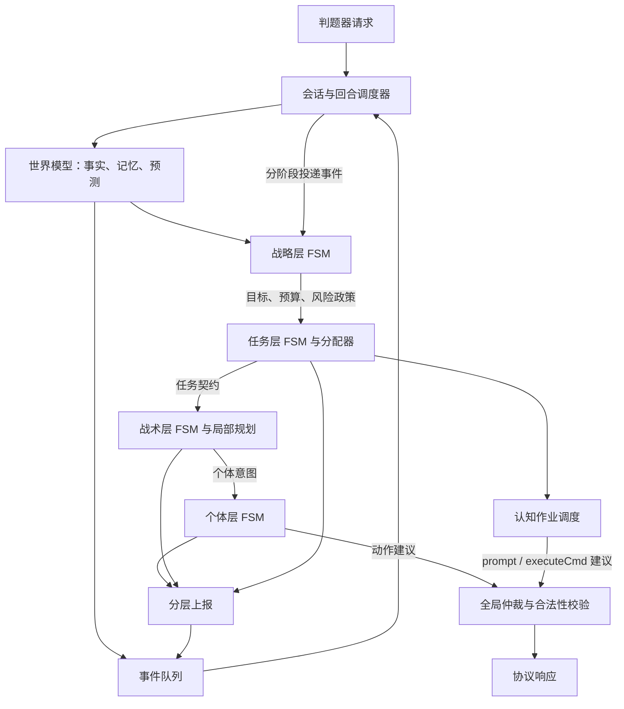
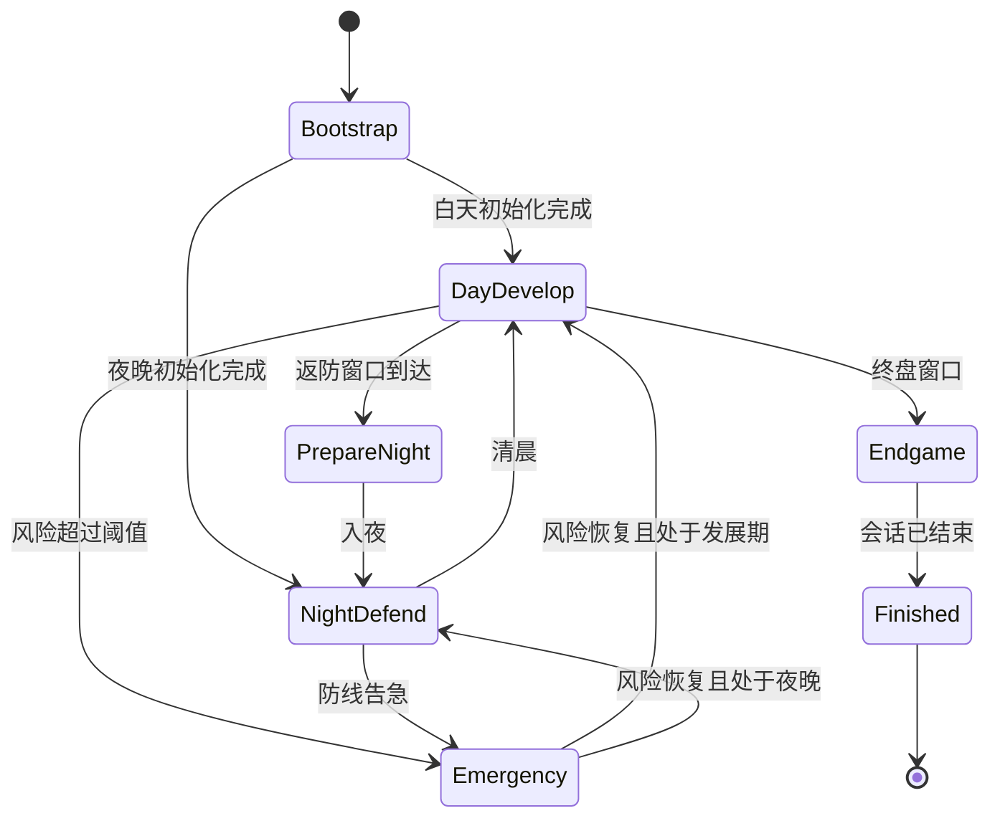
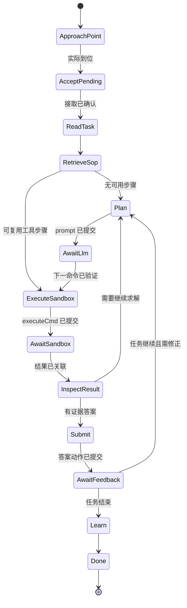

# 项目核心框架设计

> 更新：2026-09-19。状态：目标架构与首个可运行切片并存；本文件的完整状态机、接口和性能指标仍是待完成规格，实际进度见 [HANDOFF.md](HANDOFF.md)。
> 依据：[任务书](docs/docs/任务书.md)、[接口文档](docs/docs/接口文档.md)（均为 v1.0，2026-09-09）、请求/响应示例，以及 `docs/Demo/CoreGeek.tar.gz` 内的参考实现。Demo 仅提供实现线索，不是判题器规范。

实现细节导航：世界模型的工作/状态见 4.4–4.5；四层 FSM 的状态行为与完整转移表见第 6 节；事件字段、生产者、消费者及上报处理见第 7 节；挑战、认知作业与宝藏子状态机见 10.3–10.5；必须验证的状态切换场景见 11.1。

模块/层级的函数签名、类型字段、所有权、版本、错误和提交时序统一定义在 [INTERFACES.md](INTERFACES.md)。逐状态的计算、动作选择、角色职责和参数统一细化在 [BEHAVIOR.md](BEHAVIOR.md)：A01–A12 是算法，G01–G16 是守卫，第 5–8 节覆盖全部 78 个状态，第 9 节给出切换记录与数值用例。本文维护架构和状态拓扑，BEHAVIOR 维护可实现行为，INTERFACES 维护调用契约；变更时同步关联内容。

## 1. 目标与比赛约束

采用类似 RTS 游戏 AI 的分层架构：战略层决定目标和预算，任务层分配工作，战术层协调局部行动，个体层执行动作，世界模型提供统一事实与预测。各层通过类型化意图、事件和上报协作，以有限状态机管理跨回合行为。

目标优先级：稳定返回合法响应；避免基地过早被摧毁；在可接受风险内提升任务、击杀和生存积分。生存优先是策略选择，不是对所有胜负情形的替代：最终评估必须覆盖任务书第六、七章，包括换边两半场和基地先后被毁规则。

| 规则依据 | 已确认约束 | 架构影响 |
| --- | --- | --- |
| 任务书 4.1–4.3、4.5.4 | 地图 41×32，八方向移动，切比雪夫距离；允许穿过两障碍之间的对角线 | 网格寻路与距离函数统一；尺寸仍从请求读取 |
| 任务书 4.2、4.7 | 每日白天 70、夜晚 60 回合，最多 1300 回合 | 昼夜时钟、返防截止时间、跨日事件 |
| 任务书 4.5 | 两名工人、一名开拓者，初始 75 金币；武器总数同时最多 3 座 | 共享经济账本、工种约束、武器与操控者成对分配 |
| 任务书 4.4、接口 2.3 | 每个角色每回合至多一个动作；角色一次只能操控一座武器 | 全局动作仲裁，不能仅依赖响应 Map 去重 |
| 任务书 4.5、4.7 | 武器攻击先于机器人移动，伤害回合末结算 | 按当前位置规划攻击，不假设被击杀目标立即消失 |
| 任务书第五章 | 任务点任务因完成、超时、离开邻域或开拓者死亡而结束，之后冷却 30 回合 | 任务租约、站位约束、截止时间、最佳答案记录 |
| 接口 1.7、2.1 | 非自进化任务期间每日 LLM 限 3 次；任务期间免此额度；沙盒仅任务期间可用 | 回合式认知调度与额度账本 |
| 任务书第八章 | 建连超时 10 秒，发请求后响应限 5 秒；累计 5 次异常停止调度，退出不重启 | 有界计算、响应兜底、错误隔离、启动检查 |

正常存活满十天的生存项为 `10 × (1 + … + 10) = 550`。任务快速完成还有效率奖励，因此经济、防守与开拓者任务机会需要共同评估；不能让开拓者永久闲置守炮。

## 2. 项目结构与落地阶段

已创建 `src/{transport,protocol,domain,rules,runtime,world,event,fsm,ai,command}`、`tests/fixtures`、`run.sh`。下表仍是完整目标；`decision/`、顶层 `cognition/`、`telemetry/`、`configs/` 和 `tools/` 尚未创建。当前认知逻辑位于 `ai/cognition/`，状态 enum 的存在不代表其状态转移均已实现。继续使用单 Cargo package。

```text
src/
  main.rs                  # 参数解析、启动 HTTP 服务
  lib.rs                   # 可测试的回合决策入口
  transport/               # HTTP、请求大小限制、响应编码
  protocol/                # 外部 DTO、兼容解析、协议字段映射
  domain/                  # EntityId、Pos、Action、事件/上报/意图类型
  decision/                # 共享只读决策上下文、预算与层级输出封装
  rules/                   # RuleSet、地图配置、能力及动作约束
  runtime/                 # 会话、回合事务、预算、重复请求缓存
  world/                   # 快照、实体索引、差分、记忆、派生地图
  event/                   # 确定性事件队列、路由、去重
  fsm/                     # 状态转移契约、守卫、轨迹
  ai/
    strategy/              # 战略阶段与预算政策
    mission/               # 任务 DAG、分配、租约、抢占
    tactics/               # 寻路、布防、火力与控制者协调
    individual/            # 角色 FSM、技能动作建议
  cognition/               # LLM/沙盒作业、新闻、宝藏、SOP 记忆
  command/                 # 预约账本、仲裁、校验、响应编译
  telemetry/               # 决策日志、指标、回放读写
tests/
  fixtures/                # 经校验的请求、响应、连续回合轨迹
  protocol_contract.rs
  scenario_replay.rs
configs/                   # 带版本的规则、地图掩码、策略参数
tools/                     # 回放和比赛结果分析工具
run.sh                     # 当前比赛服务入口：bash run.sh <port>
```

依赖方向：`transport → runtime → 各决策组件`；决策组件依赖 `domain/rules` 和只读世界视图；`protocol` 只负责边界转换。战略层不得直接调用 HTTP 或拼接 JSON，个体层不得修改战略预算，世界模型不得依赖具体策略。FSM 各自使用 Rust `enum` 表达状态，共享转移契约；初版不需要通用脚本引擎、完整 ECS 或动态插件加载。

首阶段已用 `serde/serde_json` 处理协议，以标准库阻塞 TCP/HTTP 实现服务，避免尚未确认比赛环境时引入异步运行时。`axum/tokio` 和 `tracing` 只是早期候选，当前未采用；若性能与联调证据要求，再作单独决策。MSRV、正式运行环境和官方 HTTP 路由仍待确认。

### 2.1 已实现能力与目标差距

| 组件 | 首阶段实际实现 | 仍需完成 |
| --- | --- | --- |
| 服务/协议 | 有界 HTTP 请求、POST、类型化 JSON、重复键拒绝、同轮同负载字节缓存、完整空响应 | 官方路由/运行环境联调、结构化日志、完整事务与截止回滚 |
| 世界/事件 | 观测快照、实体差分、可见敌人记忆、矿点/建筑/新闻基础事件、同类两格任务点交互站位合并 | 三类知识和完整实体索引、预测/来源、事件 inbox 与报告路由 |
| 战略/任务 | 昼夜/返防/终盘/紧急风险近似，基础采售、受掩码保护的三炮建造、开拓者接题 | 指令/预算、全队租约分配、完整任务 DAG 与状态转移 |
| 战术/个体 | 八向 A*、夜间炮位移动/基础攻击、动作仲裁；已提交动作登记及下一回合合法性回执上报 | 联合火力、弹道、动作效果证据与完整七态个体 FSM |
| 认知/扩展 | 单次题目 prompt 与下一回合答案提交、有限新闻原文记忆 | 作业代次/额度/沙盒/SOP、新闻解析、宝藏、回放 |

当前直接由 `runtime` 调用决策、`mission` 调用战术辅助函数，这是过渡性接线。完整目标仍以类型化层级输出、批准后分配和统一事件/上报调度为准；不得把已有 enum 或响应字段当成这些契约已完成的证据。

## 3. 分层职责与数据契约



事件由调度器按阶段投递给所有订阅层；图中的回路是跨阶段/跨回合数据流，不是同步递归调用。所有层读取同一回合的不可变 `WorldView`，私有 FSM、计划和预约放在 `AgentMemory`，不得把“计划执行”写成世界事实。

| 组件 | 输入 | 输出与职责边界 |
| --- | --- | --- |
| 战略层 | 威胁、经济、得分机会、任务汇总 | `StrategicDirective`：目标权重、预算上限、最低驻防、返防截止时间 |
| 任务层 | 战略指令、人员能力与空闲状态 | `Mission`：类型、负责人、前置条件、成功条件、截止时间、依赖与抢占规则 |
| 战术层 | 任务、地形、敌情、资源约束 | `TacticalPlan`：站位、路径、武器分配、候选攻击组合与失败备选 |
| 个体层 | 当前分配与局部事件 | `ActionProposal`：单步动作、预期结果、资源需求、有效回合、优先级 |
| 世界模型 | 当前请求、历史观测和动作回执 | 确认快照、差分事件、带来源与置信度的记忆/预测 |

公共契约以 INTERFACES 第 2、7 节为准：`MissionSpec` 是任务输入，`MissionRecord` 是任务层私有状态，`MissionAssignment` 是带已批准租约的战术输入；`UnitIntent` 是个体输入，`ActionProposal` 是仲裁输入。消息携带 `TurnStamp` 和完整 `OwnerPath`，父任务取消即使子代次未变也使其建议失效。

任务类型用 `MissionKind` 与协议中的自进化 `ChallengeTask` 区分，避免“任务”混淆。动作主体由 `Action::actor()` 唯一派生：攻击主体为武器，claims 同时占用操控角色；其他动作主体为角色，不另存一份可能冲突的 actor 字段。

## 4. 世界模型

### 4.1 三种知识必须分开

- `WorldSnapshot`：当前请求明确给出的实体、位置、血量、背包、金币、价格、任务状态与错误。
- `WorldMemory`：上次见到的敌人、跨日新闻原文、已观测动作、宝藏线索、认知作业和规则版本。
- `WorldPrediction`：威胁、预计抵达时间、矿产停工窗口、可能的宝藏位置；每项携带 `source / observed_round / valid_until / confidence`。

金币、血量等事实每回合以新快照校正，不按预测交易直接累加。敌方单位从局部视野消失标记为 `Unobserved`，不能直接认定死亡；确认的静态敌方基地与围墙、全图可见机器人按其可见性规则处理。机器人清晨消失应记为清除，不能当成己方击杀。

### 4.2 世界索引与派生数据

| 数据 | 管理内容 |
| --- | --- |
| `EntityIndex` | 阵营、实体种类、生命状态、位置、建筑等级、武器冷却、角色背包 |
| `SpatialIndex` | 静态障碍、当前动态占用、交互邻域、可建造掩码、计划占位 |
| `EconomyView` | 已确认金币、按人分离的背包、商店动态清单、价格历史、预留支出 |
| `ResourceRegistry` | 矿种、矿点出现/消失、己方采集记录、可采集预测；剩余量未公开时为估计 |
| `ChallengeRegistry` | 我方任务点、有效状态、冷却、奖励、超时、当前任务会话与原文 |
| `NewsTimeline` | 官方消息和民间传闻的逐日原文、去重键、解析结果及证据 |
| `ThreatMap` | 当前机器人攻击覆盖、基地风险、行走危险度、推测敌人影响 |
| `MemoryStore` | 认知作业、SOP、历史失败、预测有效期；受大小限制并可回放 |

基地坐标是左上角，地图 y 轴向上，其占用为 `(x,y)、(x+1,y)、(x,y-1)、(x+1,y-1)`。任务点 2 的多个 `zones` 格子必须合并为同一逻辑任务点；其可交互站位取各格相邻区域的并集，并排除占用格。实际站位语义见 U03。

角色死亡后次日白天开始后 20 回合可复活且保留背包；世界模型保留身份与背包记忆，实际可派遣以观察到存活为准，不能仅靠计时器宣告复活。矿点每次出现建立新实例，避免同坐标刷新被错误继承为已耗尽。

### 4.3 规则与地图服务

`RuleSet` 集中提供距离、实体占地、能力、建造成本、昼夜、弹道、物品效果和字段要求。运行时明确返回的射程、冷却、商品名称与价格优先用于当前决策，缺失信息不伪造为确认值。规则表、地图掩码均带版本及来源。

蓝色武器区与黄色围墙区只在任务书插图中描述，接口未提供专门字段。`MapProfile` 必须保存经确认的坐标掩码；Demo 推导出的环形布局仅能作为候选。未验证的格子不允许自动建造；仍可做经济、任务和操控已有武器。换边按观测阵营及地图配置选择布局，不在策略中写死 `10010` 等 ID。

### 4.4 世界模型需要实现的工作

世界模型是事实与查询服务，不指挥角色；其生命周期 FSM 管理数据是否可用，不承载战略行为。

| 子模块 | 每回合必须完成的工作 | 给其他层的接口/结果 |
| --- | --- | --- |
| `ingest/reconcile` | 校验关键字段和回合；创建新快照；按动作记录关联回执；先记实际效果再处理任务取消 | `WorldVersion`、动作结果、输入完整性标记 |
| `entities` | 按 ID 合并角色/建筑/机器人；更新阵营、位置、生命、背包；区分不可见与已死亡 | `alive_workers()`、`controllable_units()`、`weapons()` |
| `spatial` | 计算全部占地、交互邻域和障碍；合并两格任务点；维护布局版本 | `occupied(pos)`、`interaction_cells(target)`、`can_build(kind,pos)` |
| `economy/resources` | 保留当前价格及物品原名；矿点实例化；账实核对；未知矿量不转成确定剩余量 | `available_gold(ledger)`、`inventory(unit)`、`mine_candidates()` |
| `clock` | 计算昼夜和余量；仅对真实经过的边界发事件；发布任务/返防截止提醒 | `phase()`、`rounds_until_night()`、`remaining_rounds()` |
| `challenges/news` | 跟踪任务接取代次、存续区域、期限、新闻日次；关联宝藏返回码 | `active_challenge()`、`can_stay_on_task()`、`news_since(cursor)` |
| `derived_maps` | 由当前已知机器人计算威胁、可达性和防御覆盖；缓存按世界/规则版本失效 | `risk_at(pos)`、`base_risk()`、`route_cost()`；含置信度 |
| `diff/events` | 发布位置/血量/资源/任务变化，去除重复回执；为每项事件标记证据 | 第 7.2 节的世界事件；不能凭模型猜测发布死亡事件 |
| `memory` | 保存敌人最后观测、矿点历史、新闻证据；过期预测失效，控制内存大小 | 只读历史查询；认知模块的预测需验证后才能加入 |

`EconomyView` 只提供确认的经济事实；共享决策上下文另持有 ReservationLedger 生成的 `AvailabilityView`，用于查询预约后的可用余额，世界模型不能创建任务预约。路径与火力预测也只回答查询，不替战术层决定行动。

### 4.5 世界生命周期与实体状态

| 世界状态 | 进入/每回合行为 | 转移条件与退出行为 |
| --- | --- | --- |
| `ColdStart` | 清空本会话索引；等待第一份有效观测；不对首帧缺失实体发死亡事件 | 关键字段有效则建快照进入 `Ready`；无效进入 `Degraded` |
| `Ready` | 生成版本化快照、差分和派生查询；向决策层发布 `WorldReady/WorldUpdated` | 关键观测失效进入 `Degraded`；确认会话结束进入 `Closed` |
| `Degraded` | 保留上一有效快照供诊断，标记其过期；不基于旧位置输出游戏动作；允许合法空响应 | 新的当前回合观测有效后重建并进入 `Ready`，发布 `WorldRecovered`；结束进入 `Closed` |
| `Closed` | 不推进策略；归档轨迹并清理会话资源 | 仅显式新会话进入 `ColdStart`，不能靠迟到请求重置 |

这里“关键观测失效”指当前地图、我方主体状态或回合信息不可用；缺一个可选冷却字段只禁用依赖该字段的攻击，不降级整个世界。`WorldRecovered` 后重验计划，不自动恢复旧动作。

实体观测状态为 `ObservedAlive / Unobserved / ConfirmedDead / Removed`：出现并存活进入 `ObservedAlive`；局部视野敌人消失进入 `Unobserved`；可靠死亡证据进入 `ConfirmedDead`；角色观察到复活可返回 `ObservedAlive`；被拆除建筑、消失矿点和清晨清除机器人进入 `Removed`，原因分别记录。死亡实体不应继续占据障碍格，未知敌人只进入风险记忆。无中间帧证据的同坐标矿点刷新无法精确辨别时，重置剩余量估计而不声称发现了确定的新实例。

矿点可采状态 `Available / PredictedUnavailable / Unknown / Gone`、武器可用状态 `Ready / CoolingDown / Unknown / Destroyed` 为从观测和预测生成的查询结果，不再维护与原始字段可能分叉的独立策略 FSM。

## 5. 回合管线与运行时

每场比赛一个串行状态所有者，HTTP 接收可异步，同一会话的世界更新与决策按回合提交。基础入口为 `step(observation, memory, budget) -> TurnResult`，结果包含响应、下一份内部记忆和轨迹。

上式描述概念入口；实际方法契约采用 INTERFACES 的 IF02/IF03：`begin_turn → decide → commit`。真实观测/上轮效果幂等归并，不随规划失败回滚；计划、预约和等待状态在草稿中准备，完整编码和提交回调验证成功后再原子提交。没有入选最终响应的建议不能产生 ActionCommitted 或消耗认知额度。

1. **接收与去重**：检查大小、JSON、会话和回合；同会话、同回合、同请求哈希直接返回缓存，不重复扣额度或推进 FSM。
2. **校正世界**：用新观测生成快照，对账上一回合的动作、LLM 和沙盒作业；只在对应作业仍有效时消费结果。
3. **生成事件**：比较前后快照，补充昼夜、截止时间及威胁事件；更新派生地图。
4. **上行处理**：先让个体/战术/任务 FSM 消费回执和已有事件，逐层汇总完成、阻塞、风险报告。
5. **下行规划**：战略更新预算；任务分配；战术协调；个体生成动作建议；认知调度器选择顶层请求。
6. **仲裁与校验**：统一预约角色、武器、格子、金币和物品；淘汰冲突、过期与非法建议，编译响应。
7. **提交与返回**：原子提交被选择动作的待确认记录、认知作业和响应缓存，输出 JSON；下一请求才确认效果。

本次下行新产生的普通上报进入下一回合，不再无限上行重算。紧急事件允许一次有预算的重新规划，必须清理被撤销计划的预约。跳过回合时按最新快照重建并标记中间效果未知，不虚构缺失回合。

本地设计预算：目标常规决策不超过 50 ms，软截止 100 ms，硬截止 500 ms，为官方 5 秒窗口留余量。这是待测目标，不是已经实现的性能。规划函数需要显式检查预算及候选数量，不能只给阻塞任务包一层异步超时；到截止点输出已校验子集，无法产生动作时返回 `{"roleCommandMap":{},"prompt":"","executeCmd":""}`。空动作响应需在 P1 联调验证。

超时后工作不得继续提交旧内存：回合结果带会话、回合和 generation，提交前检查一致性。基础方案保持 CPU 决策有界且串行，先不引入并行搜索线程。

接口无 match ID。以进程生命周期作为默认会话边界，缓存使用本地 `session_epoch`；队伍变化、回合回退只触发异常检测，不盲目把迟到请求当新比赛。真正重置由运行约定或显式配置确认。收到未缓存的旧请求不推进状态；同回合不同载荷记录冲突并走保守响应。

## 6. 分层有限状态机

本节是实现契约：每个 FSM 都要有状态枚举、私有记忆、入口动作、每回合行为、出口清理、转移表和测试。`S.* / M.* / T.* / I.* / W.* / C.*` 分别表示战略、任务、战术、个体、世界和认知命名空间；同名状态不能共用一份可变内存。各 FSM 属于模块对象，不是独立线程。

### 6.0 通用转移与执行规则

统一语义为 `当前状态 + 事件 + guard(WorldView, memory) → 新状态 + intents/reports`。未列出的事件只记录或忽略，guard 不满足则保持状态；`TurnStarted` 必须重新检查时间、合法性和有效期，避免丢失边缘事件后永远卡住。

| 工作 | 必须实现的行为 |
| --- | --- |
| 状态记忆 | `state、entered_round、last_progress_round、generation、retry_count、deadline、resume_hint、lease_ids`；每个实例独立 |
| `on_enter` | 初始化本状态计数/目标并提出资源需求；不能直接发 HTTP、花金币或认定动作成功 |
| `on_tick` | 读取冻结快照，计算候选和守卫；只输出类型化意图/建议/报告，不能修改其他层状态 |
| `on_exit` | 使旧意图失效；释放未提交预约或显式移交仍需保留的租约；已发送动作的待对账记录不得删除 |
| 状态转移 | 每次记录前态、事件、证据、命中的 guard、后态和副作用；自循环更新不重复执行入口逻辑 |
| 取消/换任务 | 增加任务或计划 generation，旧建议不能再提交；旧动作的真实效果仍对账，旧报告不推进新任务 |
| 终止态 | `Succeeded/Failed/Cancelled/Expired/Completed/Finished` 只允许归档或新建实例，不原地复活；世界新会话重置例外 |

**处理优先级**：先对账已经发生的效果，再处理会话终止和死亡/目标失效等硬约束，随后是紧急风险、取消/抢占/截止时间、当前状态的正常推进，最后才是可选优化。同优先级按稳定 ID 排序。死亡不能抹掉上一回合已经完成的采集，但死亡角色不能生成新动作；完成证据若发生在截止前，也不能因收到回执较晚而改判超时。

每轮各实例上行、下行各至多一次普通转移，提交阶段允许一次 `ActionCommitted/CognitiveJobCommitted` 驱动的提交/等待态转移；一次紧急重规划最多再增加一次，总计最多 4 次。新状态可生成候选，但不递归消费自身新事件。到达上限或预算用尽时保留有效状态并停止扩展；硬性死亡、终止和动作合法性校验始终执行。所有内部状态推进都不意味着同回合可以执行多条游戏动作。

事件投递时先将结果/取消标记写入所属实例的有限 inbox 或动作/作业账本，再按上限推进 FSM；消费游标只能在证据已保存后移动。因此同一回合无法连续完成的 `Sent → AwaitingResult → Validated` 等转移可在后续 tick 继续，不能因事件已出队就遗失结果。状态转移预算不限制 A 阶段对所有已提交动作的必要对账。

**初始策略参数**（是可调设计值，不是比赛规则）：连续 2 次无位置进展触发绕行；同一目标最多 3 次局部重规划后上报阻塞；紧急退出需连续 3 个观测回合风险低于退出阈值，且退出阈值低于进入阈值。进展只由新观测确认，提出计划、重复请求不重置计数。

### 6.1 战略层：全局目标、风险和预算

**实现工作**：`SituationEvaluator` 汇总基地/人员风险、经济、得分和剩余时间；`PhasePolicy` 选择阶段；`BudgetAllocator` 分配建设、补给、任务与认知预算；`GoalEmitter` 生成任务需求；`StrategyMemory` 保存风险滞回、阶段和指令版本。每回合输出一份 `StrategicDirective{version, objectives, budget_caps, min_defenders, return_deadline, risk_policy}`，仅内容变化时发布 `DirectiveUpdated`。

| 状态 | 进入时 | 每回合行为与输出 | 退出时 |
| --- | --- | --- | --- |
| `Bootstrap` | 建立阵营、能力和规则可用性清单 | 确认当前阶段与已有单位；选择可运行的经济/防御目标；缺地图掩码只禁建，不阻塞全部初始化 | 发布第一版战略指令 |
| `DayDevelop` | 恢复经济与任务候选，重估昨夜损失 | 按效用安排采集出售、合法建设、补给与开拓者挑战；为夜间防御预留预算 | 停止不能及时返回的新工作，保留已观测进展 |
| `PrepareNight` | 给驻防分配硬截止时间，检查每炮控制者和站位 | 回收远行角色，补齐防守短板；只接受可在返防前完成的工作；上报未覆盖武器 | 入夜时转交驻防任务，不释放仍有效的操控租约 |
| `NightDefend` | 发布夜间防守目标，禁止白天限定动作 | 评估防线、炮位和补给，批准必要撤退/救援；可保留满足最低防守要求的挑战任务 | 清晨重估损失并取消仅对本夜有效的计划 |
| `Emergency` | 保存恢复提示，抢占低优先任务，允许应急预算 | 优先防止进一步基地/角色损失；重新分配控制者、升级回血或用消耗品；逐回合检查恢复条件 | 重新计算当前阶段，不能直接恢复已过期的旧状态/任务 |
| `Endgame` | 标记本场进入终盘，停止不能回本的长期投资 | 在当前昼夜约束下追求可兑现积分，保留必要防守；考虑最后一次任务提交 | 仅进入紧急态或结束态，终盘标记持续保留 |
| `Finished` | 撤销未提交任务/作业，保留日志 | 若服务仍收到请求，只提供协议允许的结束/空响应 | 仅显式新会话创建新的战略实例 |

定义 `select_normal_phase(world)`：已进入终盘则选 `Endgame`，否则夜晚选 `NightDefend`，否则返防窗口到达选 `PrepareNight`，其余选 `DayDevelop`。返防窗口为 `到夜晚剩余回合 ≤ 最慢必要控制者预计返程 + 就位回合 + 安全余量`；路径未知且必要控制者远离时按防守缺口处理，不设成零。

| 从 → 到 | 触发与 guard | 转移时产生的控制行为 |
| --- | --- | --- |
| `Bootstrap → select_normal_phase` | `WorldReady/WorldRecovered`，基本阵营/时间/角色已知 | 创建目标；允许从夜晚中途初始化 |
| `DayDevelop → PrepareNight` | `DuskApproaching` 或 tick 检查返防窗口到达 | 发布返防截止与受限任务准入 |
| `DayDevelop/PrepareNight → NightDefend` | `NightStarted` 或观测已经入夜 | 禁止建造/白天行为，激活驻防；不能依赖曾收到黄昏事件 |
| `NightDefend/PrepareNight → DayDevelop` | `DayStarted` 且非终盘、无紧急条件 | 清理前一夜战术目标，恢复发展；支持跨回合跳跃 |
| `PrepareNight → DayDevelop` | 仍在白天且必要防守目标已正式撤销，不再有返防需求 | 重算短期工作；不能因 ETA 的小幅变化反复切换 |
| `Bootstrap/DayDevelop/PrepareNight/NightDefend/Endgame → Emergency` | `ThreatRaised` 或 `ReportRaised(AtRisk)`，且风险模型/最低防守缺口满足紧急 guard | 抢占低优先任务；报告本身不能绕过 guard |
| `Emergency → select_normal_phase` | 风险连续达到稳定恢复条件且关键缺口已解决 | 发新版本指令，重新审核旧任务 |
| 任一非结束、非紧急态 `→ Endgame` | `EndgameWindowOpened`；剩余回合不足既定长期投资回收窗口 | 减少长期预算；紧急态只更新终盘标记，恢复后进入终盘 |
| 任一非结束态 `→ Finished` | `SessionEnded`，有明确结束依据 | 取消全部未来意图；仅己方基地被毁不足以触发 |

`BaseDestroyed` 后撤销针对已毁基地的维修/驻防目标，重新评价存活角色的得分和保全任务，不能持续对不可逆损失触发紧急循环。第 1300 回合收到请求时仍应决策；“1300 回合已结算完”才是结束依据，不能提前空过最后一回合。



图仅展示主要路径，完整允许边以转移表和 `select_normal_phase` 为准。

### 6.2 任务层：工作分解、分配与生命周期

**实现工作**：`MissionFactory` 从目标生成有类型的任务；`DependencyGraph` 管理前置依赖；`AssignmentSolver` 对三角色做能力/收益匹配；`LeaseManager` 计算人、武器、站位、资金和用品的申请/释放请求；`MissionMonitor` 检查实际完成、阻塞、截止与抢占。实际账本只有 runtime 调用的 ResourceCoordinator 可以修改，获准后才进入 Assigned。每个任务独立 FSM，任务管理器只聚合它们，不把全队塞进一个任务状态。

任务契约除第 3 节字段外还需 `goal_predicate、dependencies、priority、interruptibility、deadline_kind、retry_policy、leases、checkpoint、completion_evidence`。`deadline_kind` 区分内部计划截止与裁判任务期限；内部过期不能伪装成裁判任务已经结束。

| 状态 | 进入和每回合行为 | 占用与退出要求 |
| --- | --- | --- |
| `Proposed` | 校验收益、工种和依赖，估计回合/资源；不合适的候选可取消 | 不占角色，仅有候选预算估计 |
| `Ready` | 前置满足，参加全局角色与资源匹配 | 预约成功才进入 Assigned；资源争夺失败不等于任务失败 |
| `Assigned` | 记录负责人/租约，发 `MissionAssigned`，等待战术接收 | 验证接收的 plan generation，禁止重复派发；失败释放临时租约 |
| `Executing` | 接收子计划进展；检查目标谓词和剩余时间；协调认知子任务 | 保留所需长期租约；游戏动作是否在途由个体状态和动作账本表达 |
| `Blocked` | 保存原因、解除条件、重试回合与截止；提出资源/路径请求 | 释放无用临时格子/资源；只在确需守位时保留人员，防止无限占人 |
| `Suspended` | 保存可恢复检查点，暂停产生新动作，定期检查任务仍有价值 | 释放角色、武器、短期站位；尚未确认支出继续对账；恢复必须重新匹配 |
| `Succeeded` | 保存目标完成证据，发一次完成报告，唤醒依赖任务 | 释放计划租约；归档，不重复领取收益 |
| `Failed` | 记录不可恢复原因与已有部分收益，向上层提出替代需求 | 释放租约，取消子作业，归档 |
| `Cancelled` | 记录上级撤销/抢占，禁止旧子计划再输出 | 内部取消不保证裁判挑战已结束；保留会话观测直到真的结束 |
| `Expired` | 记录超过本任务硬截止/用途窗口，停止后续扩展 | 已发送动作继续对账；区分规划过期与裁判超时 |

| 从 → 到 | 触发与 guard | 行为 |
| --- | --- | --- |
| `Proposed → Ready` | tick/依赖完成，前置已满足且目标有收益 | 加入可分配队列 |
| `Ready → Assigned` | 匹配成功且所有必要预约原子成功 | 发 `MissionAssigned` |
| `Assigned → Executing` | `MissionActivated`，对应战术实例已接受 | 启动进展/超时跟踪，不意味着已执行游戏动作 |
| `Ready/Assigned/Executing → Blocked` | 条件暂失或 `ReportRaised(Blocked/ResourceNeeded)` 且本层无法解决 | 保存原因；发有截止时间的资源需求 |
| `Blocked → Ready` | 对应资源/路径/目标条件恢复且未过期 | 重新竞争预约，不跳过匹配恢复旧人选 |
| `Assigned/Executing/Blocked → Suspended` | `MissionPreempted`，任务可恢复 | 取消当前计划意图并保存检查点 |
| `Suspended → Ready` | 新战略允许恢复且前置仍成立 | 增加计划代次、重新分配 |
| `Executing/Blocked/Suspended → Succeeded` | 最新实际效果证明目标已达成 | 即使完成者此时死亡，也保留此前已完成成果 |
| 任一非终态 `→ Failed` | 目标永久消失、不可恢复依赖失败或重试耗尽 | 发失败报告；是否新建替代任务由上层决定 |
| 任一非终态 `→ Cancelled` | `MissionCancelled`；或不可恢复任务被抢占 | 取消子计划/认知作业，保留已提交回执归属 |
| 任一非终态 `→ Expired` | tick/`DeadlineExpired`，完成条件未在期限内实现 | 归档期限类型与已知部分成果 |

新建任务发现目标早已满足时，直接记录 `SatisfiedBeforeStart` 并丢弃候选，不发游戏动作。任务处于终态后的迟到效果只追加事实/结算记录，不重新激活实例。对可更换工人的经济任务，`UnitDied` 通常导致 `Blocked → Ready` 重新分配；对绑定开拓者的挑战，确认死亡导致挑战失败/终止。

#### 6.2.1 各任务具体执行流程

这些是 `Executing` 内的类型化流程节点或子任务 DAG，复用生命周期，不复制十套调度器。节点完成依赖观测证据，不能在同一回合连续执行多个游戏动作。

| 任务类型 | 必须实现的节点与行为 | 完成证据及中断规则 |
| --- | --- | --- |
| `GatherAndSell` | 选择矿种/矿点 → 到交互格 → 重复采集 → 按背包/收益/返防决定返程 → 到小贩 → 出售指定数量 | 采集看背包变化；出售看矿物减少及可归因金币变化；返防可挂起，恢复时重选已消失矿点 |
| `Construct` | 确认合法地块/建筑上限 → 预约金币或工人石头 → 到施工格 → `build` → 验证建筑 | 目标格出现己方对应建筑；入夜取消未提交施工建议；覆盖旧武器必须是授权替换任务 |
| `Upgrade` | 检查目标等级 → 有券则跳过购买，否则到商店购买 → 到建筑旁 → `use` → 验证等级/回血 | 目标等级变化及用品变化；目标毁坏则失败；已有正确券可复用，不能假设角色间能转移背包 |
| `RepairOrHeal` | 选择合法修复包/药剂或另建升级任务 → 必要时采购 → 到有效位置 → 使用 | 目标生命恢复与用品消耗；角色已死不能用药，已毁建筑不能修复 |
| `Escape` | 基于 BEHAVIOR A11 选择可达安全区域 → 预约角色/路径 → 有界撤退 → 每轮重评风险 | 实际到达目标区域且风险低于退出阈值才完成；原任务取消后以新 owner 授权，不能复用失效挑战/采矿意图 |
| `DefendSector` | 匹配武器/角色 → 返防 → 占操作位 → 持续火力循环 → 清晨释放本夜任务 | 目标是防守指定时间窗，清晨且满足约定即完成；一轮攻击成功只是进展 |
| `Resupply` | 计算个人背包空位 → 购买清单 → 回到指定地点 | 指定角色持有所需物品并到位；无交易/转交动作，不设计角色互相交货 |
| `Challenge` | 到己方任务邻域 → 接取确认 → 持续守位 → 求解/提交/修正 → 观察任务结束 | 完整子 FSM 见 10.3；离开/死亡不可挂起后续接，结束原因不明时不宣称全对 |
| `Treasure` | 线索验证 → 采购准确物品 → 到候选位置 → 等待开放 → 献祭 → 评估结果 | 返回 1 才成功，4 则资源机会结束，2/3 需重新评估并对账用品；不可盲目重试 |
| `PressureOpponent` | 防守预算通过 → 购买召唤令 → 在每日数量额度内使用 → 记录预期次夜影响 | 匹配物品消耗/回执，只记录预期新增机器人；未观测到不能宣称对方波次变化 |
| `ClearOrDrop` | 指定合法墙体或冗余物品 → 移动至合法位置（如需）→ `remove/drop` | 墙体消失/背包变化；不得拆核心防线或丢任务用品，除非任务契约明确授权 |

### 6.3 战术层：把任务变成局部可执行计划

**实现工作**：`LocalPlanner` 生成目标站位和技能步骤；`PathPlanner` 找路径；`FormationPlanner` 规划炮位/出入口；`FireCoordinator` 联合选目标和控制者；`LocalRecovery` 处理堵路、冷却与撤退。计划必须带参与者、站位、下一步、预期效果、有效世界版本和取消代次，不能直接写协议。

| 状态 | 进入/每回合行为 | 输出与退出要求 |
| --- | --- | --- |
| `Plan` | 验证 Mission，选目标/站位/角色技能；计算有界候选 | `PlanReady`；接受任务时发 `MissionActivated`；无可行解报告原因 |
| `Approach` | 按计划推进到目标邻域；每回合检查目标、路径和时间 | 发单步移动意图；不要求一次规划走完整条路 |
| `Position` | 分配具体交互格或操作位，解决队友争位和操控者配对 | 到位后锁定必要租约，发 `GoalReached(kind=Position, scope=Step)` |
| `Execute` | 提供合法技能/攻击意图；火力计划每回合按当前敌情重算 | 等待本次动作真正被提交；候选被淘汰不能假装进入效果评估 |
| `Evaluate` | 消费本计划关联的回执/效果，更新局部目标和剩余工作 | 一步完成发进展；整个局部目标完成才发完成报告 |
| `Replan` | 使旧路径/候选失效；失败引发的重规划增加 `(mission,target)` 重试计数，正常节点推进不计失败；更换路线/站位/目标 | 释放旧短期预约，保留任务级必要租约；超过上限报告阻塞 |
| `Hold` | 等待冷却、开放时间、拥堵消退或认知结果；每回合检查安全与截止 | 通常不发动作；明确 `wait_reason/wakeup/deadline`，不能无期限自循环 |
| `Retreat` | 计算安全可达站位，提出逃生移动或已授权补给意图 | 发 `AtRisk/Retreating`；涉及挑战任务时先通知其即将放弃 |
| `Completed` | 保存局部目标证据，报告父任务 | 释放计划租约；父任务决定是否完成或创建下一局部计划 |
| `Failed` | 保存不可恢复原因/进度并报告父任务 | 撤销本计划，资源回收 |
| `Cancelled` | 处理任务取消/替代 | 不再生成意图，释放未提交资源，保留已发送结果关联 |

| 从 → 到 | 触发与 guard |
| --- | --- |
| `Plan/Replan → Approach` | `PlanReady`，存在可行方案且不在目标邻域 |
| `Plan/Replan/Approach → Position` | `PlanReady/GoalReached` 或 tick，已在邻域，统一进入精确站位复验（已经到位也允许） |
| `Position → Execute` | tick，角色实际到位、控制者/资源有效、当前动作可执行 |
| `Approach/Position/Execute/Evaluate/Retreat → Hold` | 暂时占格、武器冷却、暂无目标、等待开放/认知，或暂时无更安全逃生步骤；等待有明确唤醒条件和截止 |
| `Plan/Replan → Hold` | 暂无可行路线/站位但存在明确可等待条件与截止；否则失败上报 |
| `Execute → Evaluate` | `ActionCommitted`，至少一条本计划动作已经进入最终响应；多角色计划按 action ID 分别跟踪 |
| `Evaluate → Execute` | 回执已对账，局部目标仍有效且下一步能执行，例如下一轮射击 |
| `Evaluate → Approach/Position` | 已确认当前步骤，需要到下一目标或重新就位 |
| 任一活动态 `→ Completed` | 观测满足本计划完整目标；纯移动计划到位即可完成，交互计划不能只凭到位完成 |
| `Approach/Position/Execute/Evaluate/Hold → Replan` | `PathInvalidated`、目标/控制者变化、执行失败或连续无进展；尚有重试预算 |
| `Hold → Position/Execute/Replan` | 对应等待条件解除；根据当前站位与计划有效性选择，不复用过期攻击位置 |
| 任一活动态 `→ Retreat` | 风险 guard 满足且撤退有更低预期损失；所需授权由任务政策预先给出 |
| `Retreat → Replan` | 到达安全区域且父任务仍有效 |
| `Retreat → Completed` | 此任务本身就是到达安全点，且目标得到确认 |
| 任一活动态 `→ Failed` | 目标不可恢复/期限失效/重规划次数耗尽；上报父任务，由父任务决定重派或放弃 |
| 任一活动态 `→ Cancelled` | `MissionCancelled/IntentCancelled` 或新计划 generation 替代 |

`DefendSector` 中击杀一个目标不完成整夜防守任务：局部攻击计划结束后，父任务创建/更新下一个计划。冷却等待不能长期霸占一个尚未到位的工人；控制者释放与重派需经过任务租约管理器。

### 6.4 个体层：单角色执行、回执与恢复

**实现工作**：为每名角色建立 `UnitController`；`IntentInterpreter` 把战术意图转换成技能；`SkillExecutor` 检查角色级前置并生成一步 `ActionProposal`；`ActionTracker` 跟踪最终提交及回执；`StuckDetector` 检测无进展。武器本身不再拥有一个会独立抢动作的角色 FSM，其攻击由操控者和火力计划共同提出。

| 状态 | 进入/每回合行为 | 可以生成的建议与资源要求 |
| --- | --- | --- |
| `Idle` | 无有效任务，清理过期意图，发布可分配状态 | 默认无命令；安全动作也须通过一个获授权的紧急意图 |
| `Moving` | 检查下一格、任务有效性和路径版本；每次只取一步 | `move`，预约本角色及目标格；尚未提交就保持本态 |
| `Interacting` | 根据技能枚举构造字段，检查邻接、背包、金币、昼夜 | `collect/buy/sell/build/remove/use/drop/acceptTask/submitAnswer/summonTreasure` 中的一种 |
| `OperatingWeapon` | 验证角色邻接指定武器、武器冷却/目标与战术火力计划 | 以武器为 actor 的 `attack`，同时预约角色和武器；无合法目标不输出 |
| `WaitingResult` | 跟踪已提交的动作 ID/发送回合或持有挑战站位等待认知；继续响应风险和取消 | 不重发在途动作；保持必要站位，不锁死其他角色 |
| `Recovering` | 复活、位置失配或失败后重验角色能力、背包和任务；请求重派/局部重规划 | 仅执行经当前安全/任务意图授权的恢复动作；不能自行抢占他人武器 |
| `Dead` | 观察到死亡，立即取消未来建议并上报 | 无命令；释放控制者/站位，保留背包记忆与未对账动作 |

`WaitingResult` 必须区分 `ActionAck{action_id, sent_round, resume_state}` 与 `CognitiveHold{job_id, challenge_generation}`，不能把未提交建议、冷却或资源争抢误当“在等裁判”。冷却/无目标由战术 `Hold` 管理，个体可保持 `OperatingWeapon` 不输出。

| 从 → 到 | 触发与 guard | 行为 |
| --- | --- | --- |
| `Idle/Moving/Interacting/OperatingWeapon/Recovering → Moving` | `IntentAssigned`，新/继续意图需要移动、角色存活且无未处理动作回执 | 取消旧未提交候选，初始化路径跟踪 |
| 同上五个状态 `→ Interacting` | 新/继续意图要求非攻击交互、无在途动作且实际位置已合法 | 构造单一技能建议 |
| 同上五个状态 `→ OperatingWeapon` | 无在途动作，指定武器/控制者租约有效且观察到已经到位 | 接受战术火力计划 |
| `Moving/Interacting/OperatingWeapon → WaitingResult(ActionAck)` | `ActionCommitted` 且本角色确实参与该动作 | 保存动作、效果期望和恢复点；提议未获选不能触发 |
| `WaitingResult(ActionAck) → 原执行态/Idle` | 本动作结果已对账；若目标仍有效则继续，单步意图已完成且无后续则 Idle | 发进展/完成报告；待账支出按实际快照校正 |
| `WaitingResult(ActionAck) → Recovering` | `ActionRejected/ActionOutcomeUnknown` 或观测与期望不符 | 标记失败或未知，取消旧路径；不立即重放购买/献祭等消费动作 |
| `Interacting/Idle → WaitingResult(CognitiveHold)` | 持有已确认挑战会话，任务下发等待认知意图 | 保持任务邻域，等待的是作业不是某条未发出的游戏动作 |
| `WaitingResult(CognitiveHold) → Interacting/Idle` | 当前作业有效结果到达/任务层发新意图，或挑战确已结束 | 允许提交答案；结果本身不自动生成角色动作 |
| 任一存活态 `→ Recovering` | 需要局部恢复、位置失配或风险抢占；只有新的已授权逃生意图才能开始移动 | 先使未提交旧建议失效；保留在途动作记录 |
| 任一存活态 `→ Idle` | `IntentCancelled` 且无新意图/在途动作 | 释放未来租约；有在途动作则完成对账后 Idle |
| 任一存活态 `→ Dead` | `UnitDied`，可靠观测确认 | 发一次失能报告，不把处于冷却/不可见当死亡 |
| `Dead → Recovering` | `UnitRevived`，观测到血量为正的同一角色 | 重新登记可派遣，禁止仅凭预计复活回合转移 |

同回合仲裁拒绝用 `ReservationDenied/ProposalRejected`，不进入 `WaitingResult`：取消本轮建议，保留意图或上报资源不足，下一轮重新评估。`ActionAccepted` 仅表示回执为真；移动必须看到位置变化、购买必须看到背包等效果；攻击可以以可靠执行回执确认这一轮操作完成，但击杀归因仍是单独的证据问题。

### 6.5 跨层切换示例

| 场景 | 事件/上报链 | 状态切换与结果 |
| --- | --- | --- |
| 工人采集后背包满 | `InventoryChanged` → 个体 Progress → 任务节点完成 | `I.WaitingResult → Interacting` 完成对账；采集节点结束，战术规划去小贩，随后 I 进入 Moving；不在同回合追加出售 |
| 黄昏回防遇堵 | `DuskApproaching` → 战略新指令 → `MissionPreempted`；移动后连续失败 → `ReportRaised(Blocked)` | `S.DayDevelop → PrepareNight`；经济任务 Suspended；`T.Approach → Replan`；预计来不及则上报防守缺口、重派控制者，必要时 S 进入 Emergency |
| 控制者死亡 | `UnitDied` → `ReportRaised(Failed, ControllerLost)` | `I.* → Dead`；对应 `T.* → Replan/Failed`；任务 Blocked 后重新匹配；旧攻击建议因 generation/存活校验被拒绝 |
| 接取后等待 LLM | `ChallengeStarted` → 认知作业提交 → `LlmResultReceived` | 开拓者保持 `I.WaitingResult(CognitiveHold)`；任务子 FSM 按 10.3 推进；工人 FSM 独立执行 |
| 挑战期间紧急撤离 | `ThreatRaised` → 任务取消/逃生意图 → 观察到开拓者离开 | 内部先 Cancelled，认知作业失效；个体恢复后移动；只有后续 `ChallengeEnded` 才确认裁判任务结束，迟到答案不得用于新挑战 |
| 入夜同时收到价格上涨 | `NightStarted` 优先于普通 `PriceChanged` | 先进入防守/终盘对应政策；价格只更新候选收益，不覆盖返防或制造白天建造动作 |

上述示例中的同一回合可以完成内部状态更新与一次新动作提交，但永远不把“多个 FSM 跳转”当成“多个游戏动作已执行”。

## 7. 事件系统与上报系统

事件表示事实、控制消息或评估变化，上报表示下层对当前计划的执行结论。用 `evidence_kind=Observed/Derived/Predicted/Control` 区分：`EntityHealthChanged` 是事实，`ThreatRaised` 是风险评估，不能把后者写成已发生损失。事件名为内部 Rust 枚举建议，不是裁判额外提供的 JSON 字段。

### 7.1 信封、投递与优先级

统一信封：`event_id、session_epoch、observed_round、effective_round、phase、source、kind、entity_id/mission_id/plan_id/action_id/job_id、generation、priority、expires_at、evidence_ids、payload`。必要 ID 由具体类型强制提供，不能全靠可选字符串拼接。

| 投递阶段 | 允许的生产与消费 |
| --- | --- |
| A：世界更新 | runtime/world 产生观测、时钟、回执；提交新快照后供本轮所有层读取 |
| B：上行 | I → T → M → S 各消费一次并汇总；父层可在其尚未执行的 B 阶段收到子报告 |
| C：下行 | S → M → T → I 发布指令与意图；父层已执行后产生的普通上报留至下一轮 B |
| D：提交 | command 发布本地 ActionCommitted/CognitiveJobCommitted/ProposalRejected 给涉及的跟踪器；仅更新提交/等待态或拒绝记录，不再次启动普通规划 |

认知结果先在 A 归属与验证，认知状态更新作为 B 的任务子流程执行；C 产生本轮作业候选。紧急重规划是一条有界例外，消耗 6.0 的预算；无论是否有剩余重规划额度，最终校验必须删除失效动作。

优先级从高到低 `P0 终止/数据失效/生命硬约束`、`P1 危险与期限/取消`、`P2 执行结果与计划推进`、`P3 资源与机会更新`；同阶段按 `(priority, effective_round, stable_id)` 排序。已发生的效果在 A 先对账，所以 P0 不会丢掉真实收益。所有 tick 仍重验 guard，优先级并不替代规则校验。

### 7.2 事件目录

下表路由中的“全部”指有对应订阅的当前会话对象，并非每个事件广播给所有实例；单位、任务、计划和作业必须按 ID 路由。

| 事件 | 生产者/等级 | payload 必需信息 | 消费者与典型影响 |
| --- | --- | --- | --- |
| `SessionStarted / SessionEnded` | runtime / P0 | session、开始配置或结束依据 | 全部；创建/归档 FSM，不能因暂时没有 HTTP 请求判结束 |
| `TurnStarted` | runtime / P2 | round、world_version、预算 | 全部；每回合的守卫与 deadline 检查 |
| `WorldReady / WorldUpdated / WorldRecovered` | world / P2 | world_version、有效性/变化摘要 | S/M/T/I；初始化或重新检查计划 |
| `WorldDegraded` | world / P0 | 缺失关键字段、最后有效版本 | runtime/command；禁止旧位置动作；决策状态冻结 |
| `DayStarted / NightStarted` | world.clock / P1 | day、phase、边界回合 | S/M/T/cognition；阶段切换、日额度重置、撤销不合法动作 |
| `DuskApproaching` | 战略阶段评估器 / P1 | 返防截止、最慢 ETA、安全余量 | S/M；进入 PrepareNight、限制准入；它是计算事件而非官方事实 |
| `DeadlineNear / DeadlineExpired` | runtime 定时索引 / P1 | owner ID、deadline_kind、deadline、剩余量 | M/T/C；预提交、放弃或过期；阈值跨越时发一次 |
| `EndgameWindowOpened` | 战略评估器 / P1 | 剩余回合、投资窗口、配置版本 | S；设置终盘标记 |
| `UnitDied / UnitRevived` | world / P0 | entity、生命证据、last_seen_round | I/T/M/S；失能、替补或恢复派遣 |
| `EnemyUnobserved` | world / P3 | entity、最后位置/时间、可见性类型 | 世界记忆/T；转为不确定风险，不发击杀报告 |
| `EnemyRemoved` | world / P3 | 全图可见的敌方基地/墙实体、最后位置/时间 | 世界记忆/T；从当前占位移除；不把消失直接记为己方击杀 |
| `EntityMoved / EntityHealthChanged` | world / P2 | entity、前后位置/血量、观测回合 | I/T/M；到位、效果对账、更新风险 |
| `BuildingChanged / BaseDestroyed` | world / P0（毁坏）或 P2 | entity、kind、前后等级/存在性、证据 | S/M/T；建设确认、重规划、撤销不可完成的维修 |
| `MineAppeared / MineDisappeared` | world / P3 | 矿点实例/坐标、矿种、证据 | M/T；创建或更换采集目标 |
| `InventoryChanged / GoldChanged / PriceChanged` | world / P2（待账相关）或 P3 | owner/item、前后数量/价格、source | 账本/M/I；对账、解除资源阻塞、更新效用 |
| `WeaponReady` | world / P2 | weapon、cooldown=0 的观测证据 | T/I；结束冷却等待；冷却未知不能发布 |
| `NewsReceived` | world / P3 | day、channel、text_hash、原文引用 | cognition/S；按日去重并调度解释 |
| `ChallengeAvailable` | world / P3 | 逻辑任务点、isValid、cooldown、奖励/期限 | M；生成候选挑战，不自动接取 |
| `ChallengeStarted / ChallengeEnded` | world 对账 / P2 或 P1（异常结束） | challenge_generation、点位、开始/结束证据、reason 或 Unknown | M/C/I；开始求解或停止作业、解除守位约束 |
| `TreasureResultObserved` | world 对账 / P2 | 发起 action_id、结果码 0–4、用品变化 | M/C；成功、已空或重新评估，0/2 不强猜原因 |
| `ThreatRaised / ThreatCleared` | 风险评估器 / P1 | 对象、score、阈值、预测窗口、证据/置信度 | S/M/T；抢占/撤退/恢复；Cleared 不绕过稳定窗口 |
| `PathInvalidated` | T/空间缓存 / P2 | plan、path_version、障碍变化或失败证据 | T/I；重新寻路，撤销过期下一步 |
| `DirectiveUpdated` | S / P1 或 P2 | directive_version、预算/目标/截止变化 | M；更新候选与抢占，不直接改角色状态 |
| `MissionAssigned / MissionActivated` | M / T，P2 | mission、generation、assignees、计划契约 | T / M；分配握手与开始跟踪 |
| `MissionPreempted / MissionCancelled` | M / P1 | mission、generation、reason、恢复政策 | T/I/C；释放未来租约，挂起或取消 |
| `IntentAssigned / IntentCancelled` | T / P2 或 P1 | plan、unit、intent、generation、有效回合 | I；选择技能状态或取消建议 |
| `PlanReady / GoalReached` | T 或 I 的观测归纳 / P2 | plan/intent、scope、goal_kind、目标、证据 | T/M；Approach/Position 推进；角色到位不等于整任务成功 |
| `ActionCommitted` | command / P2 | action_id、actor、参与控制者、round、claims、expected_effect | I/T/账本；进入等待，提交记录，不代表裁判接受 |
| `CognitiveJobCommitted` | command / P2 | job_id、channel、task_generation、round、input_hash、quota_claim | C/所属任务流程；作业进入 Sent，上层进入对应等待态；未获选作业仍 Queued |
| `ProposalRejected / ReservationDenied` | command/账本 / P2 | intent、冲突资源或校验错误、是否可重试 | I/T/M；不进入等待，不计为裁判指令失败 |
| `ActionAccepted / ActionRejected` | world 回执归属 / P2 | action_id、原始 bool/error、actor、result_round | I/T/账本；对应 lastRoundRoleActionResults；拒绝原因未知时写 Unknown |
| `EffectObserved` | world 对账 / P2 | action_id（可归因时）、实际变化、effect_round、归因置信度 | I/M；推动步骤或目标完成；不把共享金币变化随意归给一个人 |
| `ActionOutcomeUnknown` | 对账器 / P2 | action_id、缺失/冲突证据、最后可见时间 | I/T/M；停止自动重复消费，重新核对现状 |
| `LlmResultReceived / SandboxFinished` | runtime/world / P2 | channel、sent_round、job_id（可关联时）、原始结果引用 | C；结构化检查/任务归属，过期结果隔离 |
| `CognitiveJobFailed / QuotaExhausted` | cognition / P2 | job、reason、quota_day、恢复条件 | M/C；使用 SOP/部分答案/延期，不反复消耗额度 |
| `HypothesisUpdated` | cognition / P3 | subject、证据引用、候选、置信度、有效期 | 世界预测/M/S；改变候选收益，不覆盖观测事实 |
| `BudgetLow` | runtime / P1 | 剩余时间、未完成阶段、已有效动作数 | 各规划器；停止扩展，进入本轮降级输出 |
| `ReportRaised` | I/T/M/C / 随 status | 第 7.3 节报告结构 | 直接父级；汇总后才能影响更高层 |

### 7.3 上报目录与父层处理

报告语义包括作用域、完整 owner 代次链、来源、status/reason、progress、证据、资源需求、建议与有效期，精确类型见 INTERFACES 的 ExecutionReport。角色任务使用 `Step/Plan/Mission` 作用域，无角色任务归属的新闻步骤使用 `NewsStep`，战略摘要独立用于日志。`progress` 至少包含已完成目标、剩余目标、预计完成回合及其置信度。报告建议不具有越层执行权限。

| status / reason 示例 | 产生时机与证据 | 父层需要做什么 |
| --- | --- | --- |
| `Progress / StepApplied` | 位置、背包、建造等有实际进展 | T 更新下一步，M 更新任务节点；不触发战略重置 |
| `Completed / GoalSatisfied` | 对应 scope 的目标谓词满足，附完成回合 | 父层自行复验；Step 完成只推进步骤，Mission 完成才清理任务并唤醒依赖 |
| `Blocked / PathObstructed` | 连续无进展或有可靠不可达证据 | T 优先绕行；重试耗尽才让 M 重新分配/换目标 |
| `Blocked / TargetUnavailable` | 矿点消失、目标移动或交互条件暂失 | 检查是否有替代；永久消失且无替代则 Failed |
| `Blocked / Capacity` | 个人背包放不下已计划物品，且无获准出售/丢弃方案 | 取消低优先采购或重排工作；不能借用其他角色背包容量 |
| `Blocked / WaitingCooldown/WaitingResult` | 正常等待预计超过任务容忍时间 | 更新 ETA 和守位成本；普通短等待只记 Progress，不刷屏 |
| `ResourceNeeded / Gold/Item/Controller/StandCell` | 完成目标存在明确资源缺口 | M 先调配/创建前置任务，无法解决再向 S 请求预算；附数量和最迟需求时间 |
| `AtRisk / DefenseLate/BaseThreatened` | ETA 超截止或基地风险超阈值 | M 重派；仍有缺口再报 S，由风险 guard 决定 Emergency |
| `AtRisk / UnitThreatened/Retreating` | 当前角色风险和撤退候选证据 | 使用已授权撤退政策，取消冲突意图；必要时明确放弃挑战 |
| `AtRisk / ChallengeDeadlineNear` | 求解剩余步骤估时不足 | M/C 选择最有证据的部分答案并预留提交回合 |
| `Failed / ControllerLost/TargetDestroyed/RetryExhausted` | 子计划无法继续，附已完成部分 | 父任务判断重派、替代、失败或取消；不把所有子失败直接升级为战略 Emergency |
| `Failed / CognitiveUnavailable/InvalidResult` | 无法取得/验证当前作业结果 | 切换已验证 SOP 或降级；禁止用无证据模型输出完成任务 |

战略层向 runtime 输出 `StrategySummary{state, goals, risks, budget_usage}` 用于日志，不再向不存在的“更高 AI 层”广播。认知模块作为任务求解服务向所属任务上报；新闻作业无角色任务时向战略机会评估入口上报。

### 7.4 去重、生命周期与防止循环

- 观测事件去重键为 `(session, source_round, entity/field, change_hash)`；新闻另含发布日/频道，同一文本不同日不能一概删除。动作事件以 action ID + 结果类型去重。
- 报告以 `(mission, generation, reporter, scope, status, reason)` 合并；只有进展、严重程度变化或配置的心跳窗口到达才再次上报。资源申请同样只更新数量/期限，不每回合新建重复采购任务。
- 新 assignment/plan generation 使旧控制事件和建议失效；原回合真实事件、已发送动作对账、旧任务结算证据仍保留，不因过期控制消息而丢弃。
- P3 更新可合并；关键死亡、取消、回执需持久到内存账本/快照可重建后才能消费清理。队列满时先折叠低优先级更新；关键消息仍无法容纳则标记降级并重建，不能静默丢失。
- 子层上报只触发父层一次复验，父层决定保持、重规划、重派或升级。上报返回的控制消息不得在同一阶段再次触发原报告的递归处理。
- guard 必须校验报告代次、作用域、有效期和证据；一个 `Completed(scope=Step)` 永远不能直接令整个 `M.Executing → Succeeded`。

## 8. 算法框架

### 8.1 战略评估与经济

在 FSM 可用策略内用效用评分选择计划，而非让大模型逐回合直接控制角色：

`utility = 预期积分 + λg × 经济收益 + λd × 防御改善 − λr × 风险 − λt × 占用回合 − 切换成本`。

不可违反的约束先过滤，再比较效用；权重写入版本化配置，初值是启发式假设，后续通过换边回放与消融实验调整。建立矿产“采集—运输—出售”每回合收益，结合当前价格、背包、停工预测和返防预算。不要仅按铜单价最高就一直采铜。

初始 75 金币能覆盖三座基础武器，但选型、站位和开拓者任务窗口共同决定实际建设顺序。武器总数上限按任务书补充说明取 3，而非每种各 3。升级同时回满血，应比较升级的即时防守价值与成本；召唤令属于有每日数量约束的对手施压策略，放在基础生存稳定后的可选阶段。

### 8.2 任务分配与预约

只有三名角色，初版对经过剪枝的候选任务做小规模枚举匹配即可，无需引入重型调度器。先过滤工种、前置任务、时间和资源，再最大化组合效用；平分按稳定 ID 打破。

每个任务带 `priority、deadline、interruptibility、leases`。角色、武器、交互站位采用独占租约，金币和背包物品采用数量预约；矿点不是天然独占资源，允许不同合法站位的工人共同采集。预算必须同时覆盖未来明确承诺和本回合动作，取消或死亡时释放，下一快照对账。

返防阈值随最慢被分配角色的路径长度、操作位拥堵与安全余量计算。新挑战任务只有在预估完成、必要交互以及返防时间均满足预算时才接取；紧急撤离会明确产生放弃任务的成本。

### 8.3 战术寻路与布防

- 使用八邻域 A*，基本步长为 1，启发式为到目标站位集合的最小切比雪夫距离；增加非负危险和拥堵代价。
- 寻路终点是矿点、商店、建筑或任务点旁的可交互格，通常不是目标占用格。基地按完整 2×2 占地计算。
- 维护本回合目标格预约，禁止己方争同格和互换。第一版保守地不进入其他角色当前占用格；后续仅在验证结算语义后允许有依赖的连续让位。
- 机器人预期移动和不可见敌人只能作为风险估计；没有信息就不能保证避免所有碰撞。失败后局部重规划，设重试上限。
- 布防以武器可覆盖区域、控制者可达性、墙体保护与出入口连通性评分；只搜索合法建造掩码。覆盖已有武器需显式替换任务授权，防止意外降回 level1。

### 8.4 火力与武器控制

先给可用武器匹配至多一个邻接控制者，再联合选择攻击落点，不能分别给角色和炮塔安排独立动作。按威胁、预计有效伤害、击杀收益和过量伤害评分；对至多三座武器做有预算的候选组合搜索。

- **加特林**：目标数等于当前等级；候选方向任意两条夹角不超过 90°，可用向量点积约束筛选；逐弹道预测最近机器人命中。
- **电磁炮**：单目标，按沿弹道顺序模拟剩余能量消耗，每个机器人受到 `min(剩余能量, 血量)` 伤害。
- **火箭**：目标数等于等级，中心 20、八邻域 10，多个落点可叠加；必须检查观测冷却，不能每回合开火。

线段穿格方式和非机器人阻挡需依据裁判验证；实现放在 `rules/ballistics`，不能在各策略重复猜测。允许对当前已观测目标规划，预估击杀不等于本回合障碍已经清除。敌方角色/建筑攻击、友伤与机器人攻击次序存在未细化之处，首版优先对机器人防守。

## 9. 动作编译与全局合法性

动作经过 `ActionProposal → Reservation → ValidatedAction → RoleCommand`，只有校验层可以生成待发送指令。内部使用 `Action` 枚举，避免自由字符串遗漏必填字段。

校验分两层：

1. **协议完整性**：动作码、必填字段、坐标数组长度、商品名称原样保留、响应 Map key 的字符串编码、攻击 `controllerId` 字符串。
2. **规则与资源**：工种/生命状态、昼夜、距离、射程/冷却、物品/金币/背包、任务状态、建造区与数量上限、控制者和目标格冲突。

| 动作组 | 必须覆盖的检查 |
| --- | --- |
| `move / collect / build / remove` | 单坐标；边界、邻接、障碍/工种；采集预测限制；建造昼夜、材料及区域 |
| `attack` | 夜晚；武器存活、冷却与射程；控制者邻接；武器/角色各占用一次；多目标数量/锥角 |
| `buy / sell` | 对应商店邻接、正数量、动态清单、资源和容量 |
| `acceptTask / submitAnswer` | 开拓者、己方任务、邻域与任务会话；答案非缺失且属于当前任务 |
| `summonTreasure` | 开拓者、单目标邻接、献祭背包多重集；合法但未成功也会消耗用品 |
| `use / drop` | 物品存在；`use` 按物品检查目标、等级和范围；药剂/召唤令无需位置 |

升级券和修墙包要求邻接目标；眩晕法宝与炸弹仍需单个目标，但没有使用距离限制，仅影响机器人。召唤令每天最多使用 10 张，账本跟踪已确认与待确认数量。

默认冲突次序：强制有效性约束 → 紧急防守 → 截止时间紧迫的任务 → 常规发展 → 可选探索；每层效用只在约束内比较。操控炮塔时响应以**武器 ID** 为 key，同时消耗操控者动作槽，不再为该角色输出移动/采集等指令。

动作合法且字段完整但碰撞、落点无目标等属于执行失败，不自动累加为队伍异常。`lastRoundRoleActionResults` 只给布尔值，不是完整效果证明；报告失败原因时标记“观测确认”或“推测”。日志统计观测错误与本地估计，不能声称知道裁判未提供的累计异常数。

## 10. 大模型、沙盒与任务求解

### 10.1 跨回合认知作业

比赛中的模型通过响应 `prompt` 提交，下回合由 `llmResp` 返回；沙盒通过 `executeCmd / lastCmdResult` 交互。HTTP 回合处理不直接等待外部模型，不在本机执行比赛任务给出的命令。沙盒离线且官方允许执行最长 15 秒，这与本队 HTTP 的 5 秒响应窗口是两个独立限制。

`CognitiveJob` 状态为 `Queued → Sent → AwaitingResult → Validated → Applied`，旁路 `Failed / TimedOut / Cancelled`。记录 `job_id、kind、task_generation、sent_round、deadline、input_hash、prompt_version、evidence_ids`。每个通道最多一个未完成作业；协议无回传 job ID，靠发送回合与任务代次关联，无法关联的结果进入隔离记录，不能应用于新任务。初版自进化求解按依赖串行使用 LLM 和沙盒。

额度：非任务期间每日最多 3 次，认知调度器统一预约，优先用于有经济价值的新闻解析和累计宝藏线索；自进化任务只有在观测确认已经接取后才进入免额度模式。发出 `acceptTask` 的当回合不假设免额。重复请求不重复提交作业；空 prompt 是否完全免调用通过 P1 验证。

### 10.2 三类任务策略

- **官方新闻**：抽取矿种、停工起止日、价格影响与证据片段；相对日期以新闻发布日转换，预测不能覆盖接口当前价格。失败时保留原文和当前价格策略。
- **民间传闻**：按日累积线索，维护宝藏位置、开放时间和物品多重集的候选及矛盾；`lastSummonTreasureResult=2` 不能区分地点错误与尚未开放，不能直接删除某地点。只在收益/置信度足以覆盖用品消耗时尝试，成功或已空后停止投入。
- **自进化任务**：由第 10.3 节的 `ChallengeState` 管理接取、检索、规划、跨回合求解、提交与学习。等待期间保持任务站位；答案错误可在截止前修正，尽早保留可用部分答案。接口未保证明确返回通过率，因此只记录可观测证据，不虚构最佳分数。

SOP 保存任务族、输入条件、工具能力、经过验证的步骤模板、参数、成功/失败案例和版本。命中新任务先核对环境与前置条件再复用。`exitCode=0` 仅证明命令执行成功，不证明答案正确；处理 `[TIMEOUT]`、`[JUDGER_ERROR]`、`[TRUNCATED]` 时不得把不完整输出当完整证据。

模型输出必须经结构化解析、证据核对和动作校验；新闻和任务文本属于任务数据，不能修改框架规则或任意扩大工具权限。对生成命令实施任务范围、长度与能力检查，并只发送至比赛沙盒。限制上下文大小，保留原文索引与必要证据，日志不记录密钥。

`AGENT_CONTEXT.md` 是开发 Agent 的交接记忆；比赛运行时记忆属于 `cognition/MemoryStore`，二者不能混用。

### 10.3 自进化任务子状态机

`ChallengeState` 由任务层的 `Challenge` 任务拥有，认知模块仅负责执行作业；站位和角色动作仍经过 T/I/command，不能由求解器绕过动作仲裁。每个实例绑定 `challenge_generation、point_id、pioneer_id、accepted_round、deadline、answer_version、best_evidenced_answer`。

| 状态 | 必须实现的动作和行为 | 事件/guard → 下一状态 |
| --- | --- | --- |
| `ApproachPoint` | 检查点位对己方有效、开拓者存活且有完成/返防余量；给战术层下达到邻域意图 | 实际到位且无当前未结束挑战 → `AcceptPending`；任务点永久失效/取消 → `Aborted` |
| `AcceptPending` | 只提出一次 `acceptTask`；未被仲裁选中继续等待准入，已提交则等待回执/任务原文 | `ChallengeStarted` 可靠关联本次接取 → `ReadTask`；拒绝后条件可恢复 → `ApproachPoint`；超时/不能关联 → `Aborted` 并保留待核对记录 |
| `ReadTask` | 固定原文和哈希、开始回合、站位约束、可用工具；检查 task generation；未知期限记录不确定性 | 最小任务信息齐全 → `RetrieveSop`；缺信息则有限等待，不用旧题补齐；任务结束 → `Learn` |
| `RetrieveSop` | 检索已验证任务族和适用条件，提取参数；命中不等于答案可直接复用 | 有可执行 SOP 下一步 → `ExecuteSandbox` 或 `Submit`（已有足够答案证据）；否则 → `Plan` |
| `Plan` | 制作有证据的下一步计划；确定能否本地解析或需模型；先检查剩余回合 | 本地计划明确 → `ExecuteSandbox/Submit`；LLM 作业真正提交 → `AwaitLlm`；无预算且无可提交答案 → `Aborted` |
| `AwaitLlm` | 保持开拓者站位，工人继续工作；不重复发送相同 prompt；检查 job/任务代次 | 已验证模型结果给出命令 → `ExecuteSandbox`，给出有证据答案 → `Submit`；可恢复错误 → `Plan`；结果仅有未经证实断言则留在求证流程 |
| `ExecuteSandbox` | 生成并验证一条任务范围内命令；确认当前观测挑战仍在进行，不允许同回合安排离开任务区域 | executeCmd 作业提交 → `AwaitSandbox`；未获选保持本态；能力/前提不符 → `Plan` |
| `AwaitSandbox` | 保持站位，记录最长等待窗口，不在 HTTP 内等待；不重发可能有副作用的命令 | 归属有效的 `SandboxFinished` → `InspectResult`；作业失败 → `Plan` 或临近期限时 `Submit` |
| `InspectResult` | 校验退出码、截断、输出结构；只提取有支持的答案字段或下一步证据 | 还需工具 → `ExecuteSandbox`；需重新推理 → `Plan`；已有可提交答案/期限接近 → `Submit` |
| `Submit` | 序列化答案版本，提出一次 `submitAnswer`；保留证据与已提交版本，禁止无变化重发 | 对应角色动作提交 → `AwaitFeedback`；被仲裁淘汰且未过期保持本态 |
| `AwaitFeedback` | 观察 errors、phaseTask、任务点状态与收益；无错误不等于全部正确 | 当前任务仍在进行且需修正 → `Plan`；`ChallengeEnded` → `Learn`；缺反馈有限等待，禁止无依据宣告成功 |
| `Learn` | 保存可验证 SOP/失败案例、答案与结果；若结束原因不明，标记 outcome=Unknown；取消剩余作业 | 一次本地归档完成 → `Done`；不为学习继续占用已结束任务的沙盒权限 |
| `Done` | 向父任务交付 `Full/Partial/Unknown` 结果及证据，释放站位 | 终态；只有满足父目标才报告 Succeeded，部分/未知不能伪装满分 |
| `Aborted` | 记录取消/死亡/规划截止，取消作业、释放未来计划并保存已有部分成果 | 终态；父任务映射 Cancelled/Failed/Expired；实际裁判会话仍由 world 追踪直到结束 |

全局转移优先于表中普通边：任一活动态收到父任务取消或开拓者死亡进入 `Aborted`；仍拥有任务且收到可靠 `ChallengeEnded` 时进入 `Learn` 记录真实结果。已经 Aborted 的迟到结束/效果只补归档，不重新激活。规划截止前若存在未提交且有证据的答案，`DeadlineNear` 优先转入 `Submit`，必须为发送及回执预留回合；不知道真实期限时不能声称一定赶得上。

任务点和开拓者只能拥有一份有效挑战会话。内部任务取消但开拓者仍在点旁时，不能假设裁判已清空题目并立即再接新题；以 world 的实际会话状态作为 `acceptTask` 和免额度/沙盒许可的 guard。



### 10.4 认知作业与新闻/宝藏流程

通用 `CognitiveJobState` 服务于多种上层流程；不得把“LLM 作业成功返回”直接解释为“游戏任务完成”。

| 作业状态 | 行为 | 转移条件 |
| --- | --- | --- |
| `Queued` | 保留输入、归属和截止，检查日额度/任务豁免、通道空闲；只产生作业候选 | 真正进入最终响应 → `Sent`；无有效归属 → `Cancelled`；排队过期 → `TimedOut` |
| `Sent` | 记录发送回合、输入哈希和额度承诺；不因响应缓存重发而再扣次数 | 下一有效输入开始处理 → `AwaitingResult`；该状态下即有可关联结果也按相同验证流程消费 |
| `AwaitingResult` | 等待对应通道返回；守卫关联回合、任务代次和结果长度 | 可关联且结构/证据验证成功 → `Validated`；明确错误/无效结果 → `Failed`；过期 → `TimedOut` |
| `Validated` | 将结构化结果交给所属流程，应用前再验证任务仍有效 | 消费成功 → `Applied`；归属过期 → `Cancelled` |
| `Applied` | 标记恰好应用一次，归档证据与额度 | 终态 |
| `Failed` | 记录额度错误、解析错误、工具错误等，发 `CognitiveJobFailed` | 终态；重试必须创建新 job 并重新检查预算 |
| `TimedOut` | 取消结果对当前流程的写权限，上报等待失败 | 终态；不能假定远端没有执行，也不自动返还已承诺调用次数 |
| `Cancelled` | 停止尚未发送工作；已发送则留作业墓碑以识别迟到结果 | 终态；结果仅归档，不推进新任务 |

任一非终态在归属任务取消时进入 `Cancelled`；超过作业截止且未应用结果则进入 `TimedOut`。`Sent/AwaitingResult` 收到明确执行错误可直接进入 `Failed`。多个事件同时到达按 6.0 先保存事实，再判结果是否仍有权应用；结果到达本身不解除取消。

作业取消不等于通道已经可以无歧义复用。保留最近在途/终止作业的 `sent_round` 墓碑；仅在旧结果被消费/隔离，或已验证的协议下一回合契约能明确排除混淆时释放通道。U07 未确认且返回归属不唯一时，隔离结果并降级，不能随意绑定到最新 job。

**新闻处理**使用 `NewsWorkflow` 的 `Collect → Extract → Validate → Publish`，失败分支为 `Deferred/Rejected`：

| 状态 | 行为及下一状态 |
| --- | --- |
| `Collect` | 按发布日/频道存原文和证据 ID；有新数据进入 Extract，无变化不创建重复流程；无内容条目进入 Rejected |
| `Extract` | 尝试本地结构化或调度认知作业；结果返回后进入 Validate；没有额度则 Deferred |
| `Validate` | 核对矿种、相对日期、停工区间和原文证据；有效进入 Publish，可补的上下文缺失进入 Deferred，矛盾/伪证据进入 Rejected |
| `Publish` | 发布带有效期的 `HypothesisUpdated`，只更新预测；终态 |
| `Deferred` | 等待额度重置或新的必要线索；仍有价值则回 Extract，过期进入 Rejected |
| `Rejected` | 留原文与失败原因；本流程终态，未来新证据创建新版本而非覆盖旧记录 |

**宝藏流程**由任务层管理，线索阶段可以没有角色租约，进入采购/移动阶段才分配开拓者：

| 状态 | 行为 | 转移条件 |
| --- | --- | --- |
| `CollectClues` | 聚合各日传闻，不移动开拓者；请求有价值的信息提取 | 新线索/`HypothesisUpdated` → `Infer` |
| `Infer` | 维护位置、开放时间、用品多重集候选及矛盾 | 有候选 → `Validate`；信息不足 → `CollectClues` |
| `Validate` | 检查证据、置信度、预算与返防成本 | 可兑现收益足够 → `AcquireSupplies`；缺证据 → `CollectClues`；需改候选 → `Reassess`；耗尽/无可行预算或窗口 → `Abandoned` |
| `AcquireSupplies` | 派生仅供开拓者使用的采购任务；已有准确物品则跳过采购 | 背包满足 → `Travel`；价格/容量/窗口改变 → `Reassess`；商品/资金不可得且无解 → `Abandoned`，暂缺则父任务 Blocked |
| `Travel` | 到候选祭坛一格内的可站立位置 | 实际到位且未开放 → `WaitWindow`；条件已满足 → `Summon`；风险/路径变化 → `Reassess` |
| `WaitWindow` | 保持安全站位，检查开放预测和返防期限，不反复献祭试时间 | 开放条件满足 → `Summon`；窗口不再可行/有冲突证据 → `Reassess` |
| `Summon` | 构造准确用品多重集和单一目标建议 | 动作提交 → `AwaitResult`；条件变化 → `Reassess`；未提交且条件有效保持本态 |
| `AwaitResult` | 按 action ID 对账结果码及背包 | 码 1 → `Completed`；码 4 → `Abandoned`；码 2/3 → `Reassess`；码 0/无结果先等对账宽限，仍未知 → `Reassess(Unknown)` |
| `Reassess` | 对账已消耗用品；码 2 保留位置/时间两种可能，码 3 重查用品；禁止无变化重复消费 | 新证据仍值得投入 → `Validate`；信息不足 → `CollectClues` 并释放角色；无可行机会 → `Abandoned` |
| `Completed` | 保存成功证据和奖励观测，取消同场其他探索候选 | 终态 |
| `Abandoned` | 记录耗尽、风险、预算或取消原因，释放角色/用品预约 | 终态；新信息只允许在宝藏未确认耗尽时创建新流程 |

任一宝藏活动态受到父任务取消进入 `Abandoned`，已发送献祭仍需对账；临近战斗可挂起可恢复的采购/移动父任务，恢复后重新 `Validate`，不能直接复用旧开放时间。

### 10.5 认知结果触发状态切换的边界

`LlmResultReceived` 先推进认知作业；只有 `Validated` 结果才能让挑战从 AwaitLlm 推进，或让新闻/宝藏更新假设。输出格式错误、引用不存在、归属不明、过期以及把任务文本当控制指令的结果都走 Failed/隔离。世界事实和规则不因模型指令而改变。

`QuotaExhausted` 只阻止需要新模型调用的分支，不阻止移动、防守、本地 SOP、合法沙盒步骤或提交已有答案。LLM/沙盒子作业失败也不直接让战略进入 Emergency；必须由父任务根据实际损失和风险上报。

## 11. 可观测性与验证

每回合记录请求哈希、配置版本、关键观测、FSM 转移、候选淘汰原因、最终响应、认知作业和耗时；完整回放可选开启，使用有界缓冲与轮转，日志故障不得阻塞响应。

同一观测序列、初始记忆、配置、固定随机种子和确定工作量预算应得到相同输出。实时墙钟降级可能随硬件负载改变截断位置；严格回放应使用固定扩展额度或重放记录的截止决策，接口见 IF16。离线回放用于检验决策一致性，不替代完整判题器仿真；缺少裁判实现的弹道/碰撞必须标注验证范围。

测试重点：协议兼容、昼夜边界、世界差分、FSM 转移、任务取消释放预约、金币并发承诺、控制者冲突、合法移动/火力、跨日额度、认知过期结果、重复请求与超时降级。详细里程碑及验收见 [PLAN.md](PLAN.md)。

### 11.1 状态机实现的必测轨迹

以下是未来验收规格，本次文档修改没有实现或运行这些测试。每条转移至少测试 guard 成立、guard 不成立、重复事件三种情况；全局取消/死亡/截止边覆盖所有活动状态。

| 编号 | 输入与关键初态 | 必须观察到的状态/动作结果 |
| --- | --- | --- |
| FSM01 | 首帧是夜间而非第 1 回合 | W 进入 Ready，S 从 Bootstrap 按实际时间进入 NightDefend，不能先做一次白天建造 |
| FSM02 | `DuskApproaching` 与价格上涨同轮到达 | S 进入 PrepareNight，不能因价格机会接受无法返防的采集任务 |
| FSM03 | 两个角色目标格冲突，或合计支出超预算且各自单独可负担 | 只有一个建议提交；未获选者不进 WaitingResult，不等待不存在的回执 |
| FSM04 | 连续 2 次已提交移动未发生位置进展；局部重试耗尽 | I 恢复、T Replan，最终向 M 报阻塞；不无限空转或创建重复采购任务 |
| FSM05 | 操控者死亡且队伍有替补 | I Dead，攻击租约释放；T/M 重派，旧 generation 攻击被拒绝 |
| FSM06 | 队伍预计复活时间到，但请求尚未出现存活角色 | I 保持 Dead；只有真实 UnitRevived 才进入 Recovering |
| FSM07 | 完成效果与死亡/截止同次观测到达 | 先记录上一轮有效成果，再停止未来动作；不得抹去已完成收益或给死者新动作 |
| FSM08 | 正在 AwaitLlm 时任务取消，新任务随后建立，旧结果到达 | 旧作业只归档，不能推进新挑战；通道释放符合墓碑/关联规则 |
| FSM09 | 任务已提交答案，但只有错误消失，没有可靠完成证据 | 不宣布满分；等待/记录 Unknown，期限到按真实观测收尾 |
| FSM10 | 火箭冷却数为正、未知、恢复到 0 | 前两者不攻击；真实 WeaponReady 后 T Hold 可恢复执行 |
| FSM11 | 到位报告是 `scope=Step`，父任务是整夜防守 | T 推进操作阶段，M 仍 Executing，不提前释放全部防守资源 |
| FSM12 | 内部取消挑战但开拓者仍留在任务邻域 | 不推断 ChallengeEnded，不立即接新题；实际会话决定沙盒和额度权限 |
| FSM13 | 认知作业结果在转移预算耗尽时到达 | 结果保存在实例账本，下一 tick 可继续验证，不能丢失或重复应用 |
| FSM14 | 关键观测无效后恢复，期间存在旧路径和攻击建议 | W Degraded 时只降级响应；恢复后重验计划，旧坐标动作不能复用 |
| FSM15 | 己方基地被毁，但仍有存活角色且判题器继续调用 | 撤销失效基地任务，重新寻求可行得分；不进入 Finished 或无休止紧急循环 |
| FSM16 | 第 1300 回合请求、随后明确结束 | 最后回合仍生成合法决策；结束确认后才 Finished |

## 12. 未决问题与保守处理

| 编号 | 问题与来源 | 当前处理 | 验证办法 |
| --- | --- | --- | --- |
| U01 | 可建造区域仅见任务书插图，接口无掩码；Demo 使用基地周边推导 | 规则配置承载已确认坐标，未知格禁建 | 获取官方地图/裁判规则，核对两边完整布局；P0/P3 门槛 |
| U02 | 文档未明确首回合编号；Demo 用 `(roundNo-1)%130` | 暂定 1 起始：1–70 白天、71–130 夜晚；异常编号不默默套用 | 验证 1/70/71/130/131 与复活边界 |
| U03 | 任务点既被描述为阻挡，又有“处于任一格即可领取”文字 | 暂以其占地邻域交互，不进入任务点格 | 用官方轨迹确认两格任务点领取与任务存续区域 |
| U04 | Demo 接受任意 POST 路径；正式路径、并发/重试与空动作约定未明确 | 配置化路由；初版支持 POST `/`，空动作参照 Demo | 官方启动/调用联调，记录请求 method/path |
| U05 | 请求示例缺少 `timeoutRounds/cooldown/targetTeam`；射程、物品大小写与表格不完全一致 | 兼容解析为可缺失值；不假定冷却为 0 或任务无限时；名称保留原样 | 建立真实协议样本与受控别名映射；正式字段优先 |
| U06 | 直线穿格、友伤、对玩家单位伤害与同回合攻击细节不完整 | 弹道组件可替换；初版以机器人防守为主 | 对裁判做边界用例，不能以 Demo 证明规则 |
| U07 | 无 match ID、重置标志、认知请求 ID | 单进程会话、按回合/代次关联、过期结果隔离 | 确认半场是否重启、结果是否严格下一回合到达 |
| U08 | 攻击时操控者是否还能另行动作未单独细化 | 按每角色单动作保守占槽 | 用武器 key 与 controllerId 的真实回执验证 |
| U09 | 引用的《编译运行环境说明》未随当前 docs 提供 | 不承诺目标平台、可用系统包或编译器版本 | 开始交付前取得环境说明并锁定依赖/构建方式 |

局部不确定性只阻止依赖它的功能，不阻塞其他模块实现；进入比赛前必须解决影响基本建造、协议与启动的门槛问题。重大选择和变更理由记录在 [DECISION.md](DECISION.md)。
