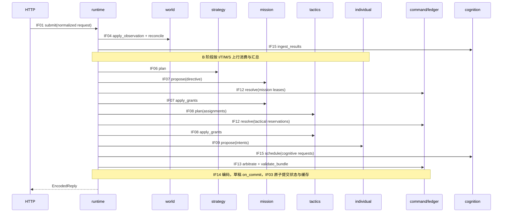

# 模块与层级接口契约

> 更新：2026-09-21。状态：完整目标接口基线；第一阶段仅实现其简化子集。本文定义目标字段、调用方向、所有权、错误和时序；[DESIGN.md](DESIGN.md) 定义架构和 FSM 拓扑，[BEHAVIOR.md](BEHAVIOR.md) 定义逐状态算法与策略参数。Rust 签名为目标契约示意，不等同于当前源码签名。
> 官方 JSON 仍以 `docs/docs/接口文档.md` 为准。本文中的 ID、版本和事件字段是内部元数据，不能擅自加入比赛响应。

## 1. 接口边界与实现方式

当前源码入口为 `transport::serve(port)` → `runtime::Session::handle(&[u8]) -> Vec<u8>` → `protocol::decode/encode`、`world::World::apply`、`ai::decide`、`command::Arbiter::propose/finish`。`Session` 先持久化观测和上一轮合法性回执，再克隆 `DecisionState` 草稿；新动作、任务记录、owner 分配和战略事件游标仅在决策成功、编码及截止检查通过后提交，并缓存同回合同请求结果。`MissionRegistry` 持久保存 MissionRecord，依赖只从不可变 MissionSpec 读取；spec 已包含目标谓词、能力、deadline、优先级、可中断性和重试策略。完整 spec 相同才复用 mission/plan，每步新建 intent；决策开始时求值 goal/deadline，经济任务额外用提交时的物品/金币基线对账连续采集和出售效果。实时策略为经济、建设、挑战及防守附加规则窗口 deadline，并冻结活动任务的自动相对期限。任务提案在 owner 分配前检查 deadline 与当前角色的全部 required capabilities，攻击使用 controller 的能力。简化 `ActionProposal { actor, owner, action }` 进入仲裁后经过两次完整链校验，等待和 Step 报告复用获准路径。仍无正式 `TurnStamp`、ResourceCoordinator、层级输出/报告队列或 IF16 回放；自动策略尚未产生任务依赖。合法回执仍不等于效果确认。现有 `WorldView` 是观测的只读查询封装，不等同于本文完整 WorldSnapshot。

本阶段 `WorldView::task_cells/task_stands/adjacent_task` 将同一任务点的多格 `zones` 合并为交互候选；目前仍采用相邻格交互的保守假设，正式站位语义待 U03 联调。

| 接口组 | 第一阶段实现范围 |
| --- | --- |
| IF01–IF03 | JSON/HTTP、重复键/地图实体与 footprint 边界校验、简化回合缓存与草稿提交；未完成正式事务代次、官方路由验证和结构化日志 |
| IF04–IF05 | 世界就绪/降级/恢复、有效快照保留、基础差分/记忆、几何/动态建造环、局部动作校验；无完整预测和规则服务 |
| IF06–IF09 | 直接函数调用、完整基础 MissionSpec、角色能力/期限准入、规则窗口 deadline、私有 MissionRegistry/只读 MissionView、依赖传播、基础 goal/deadline 与经济 progress 对账、每步新 intent；未实现自动任务分解、其他进展字段、层级消息和正式提案元数据 |
| IF10–IF11 | 事件/状态 enum、稳定 ID 的有界事件日志、四个层级读者的独立 cursor/poll/ack、截断和陈旧 receipt 检测、带 intent scope 的有限 Step 报告及旧 owner 隔离；无信封过滤/完整路由或通用 FSM 驱动 |
| IF12–IF14 | 本轮内角色、目标格、金币的基础预约与响应编码；其余资源/动作及回执未覆盖 |
| IF15–IF16 | 单次 LLM prompt/下一回合答案；无完整作业、沙盒、SOP、遥测/回放 |

同进程 Rust 模块间以函数/方法及类型化消息交互。只有 HTTP 边界异步；世界更新、决策、预约和提交由单会话状态所有者串行执行。下层不持有上层对象的可变引用，各层不相互直接调用：runtime 调用组件，再按契约路由其输出。

下述 `fn` 签名默认实现为所属模块的 `pub(crate)` 方法/函数；只有 `lib.rs` 的测试/服务入口按实际需要公开。仅时钟、日志接收器、回放输入等可替换边界使用 trait，不为每个内部结构创建 trait。类型按职责拆文件，代码须遵守 AGENTS 的文件、函数、复杂度和测试分文件要求。

| 模块/拥有者 | 允许依赖 | 主要接口 | 禁止事项 |
| --- | --- | --- | --- |
| `domain` | 标准库及必要基础类型 | ID、值对象、数据契约、动作/消息枚举 | 依赖具体 AI、HTTP、可变全局状态 |
| `protocol` | domain、序列化库 | IF01、IF14：DTO 解码/规范化/编码 | 推断战略、执行动作、读取 AI 私有状态 |
| `transport` | runtime 服务门面、网络库 | IF01：接收请求、发送已编码响应 | 自行推进 FSM 或绕过缓存重算 |
| `runtime` | 各组件的公开契约 | IF02/IF03：会话、阶段编排、事务提交 | 散落实现寻路、战斗等业务算法 |
| `world` | domain、rules、显式传入的历史记录 | IF04：更新/查询/差分 | 创建任务、预约预算、调用 AI |
| `rules` | domain、只读配置/查询契约 | IF05：规则判断、几何/弹道服务 | 读取具体策略状态或改变世界 |
| `decision` | domain、world/rules 只读接口、策略配置 | TurnContext、TurnBudget、LayerOutput 等共享调用上下文 | 持有会话或具体 AI 层的可变对象 |
| `event / fsm` | domain、泛型上下文 | IF10/IF11：投递/转移 | 回调任意层造成递归执行 |
| `ai/strategy` | domain、只读 world/rules、fsm | IF06：全局目标与预算 | 直接输出 RoleCommand |
| `ai/mission` | 同上及只读资源视图 | IF07：任务、分配、租约请求 | 直接修改账本或个体状态 |
| `ai/tactics` | 同上及局部规划服务 | IF08：计划、站位、火力和意图 | 改战略预算、直接发送动作 |
| `ai/individual` | 同上 | IF09：单步动作建议及回执处理 | 自行分配全队任务、绕过仲裁 |
| `command` | domain、world/rules 查询 | IF12–IF14：账本、仲裁、校验 | 把计划支出写入世界事实 |
| `cognition` | domain、world/rules 查询、fsm | IF15：作业/SOP/假设 | 直接执行本机 shell、在回合内等待外部 LLM |
| `telemetry / replay` | domain 中的轨迹契约 | IF16：有界记录、离线回放 | 阻塞实时响应或修改策略 |

跨层消息与值对象属于 domain 的契约子模块；聚合 world/rules 引用的 `TurnContext`、`TurnBudget` 和 `LayerOutput` 属于共享 `decision/`，各 AI 层及 cognition 可依赖它，避免让 domain 反向依赖 world。算法实现属于各自模块。规则校验接收只读 WorldView；world 构建过程只用 rules 的基础几何/规则数据，不调用依赖完整 WorldView 的动作校验，因此调用链无递归。

## 2. 通用值类型、版本与所有权

### 2.1 基础类型

| 类型 | 定义/不变量 |
| --- | --- |
| `EntityId` | 裁判实体 ID 的独立整数 newtype，不能与任务/作业 ID 混用；进入系统时校验数值范围 |
| `ObjectiveId / MissionId / PlanId / IntentId / ProposalId / ActionId / JobId / LeaseId / LeaseRequestId / EventId / ReportId / NewsId / ReservationTxnId` | 各自独立 newtype；由会话级 ID 分配器按确定顺序分配，不依赖墙钟或随机 UUID |
| `SessionEpoch / Generation / WorldVersion / RulesVersion / ConfigVersion / LedgerVersion / DirectiveVersion` | 独立版本 newtype；checked arithmetic；不允许跨类型直接比较 |
| `Round / Day` | 非负整数值对象；首回合起点由经确认的 RuleSet 定义，不在调用点猜测 |
| `Pos` | 有符号 `x/y`，转换网格索引前检查边界；避免基地 footprint 的减法下溢 |
| `Money / Quantity` | 非负金额与正数量；购买/出售数量不得为零；计算溢出返回错误 |
| `ItemKey / BuildingKind / Faction` | 商品名原样保存；建筑/阵营类型化；未知名称只在边界显式保留，不能默默映射成熟悉物品 |
| `Score / RiskScore / Confidence` | 带约定刻度的值对象；风险/置信度范围校验，评分并列按稳定 ID；不使用 NaN 或未定义的浮点排序 |
| `EvidenceRef` | 原观测/回执/原文记录的只读引用 ID，含来源回合；本地推断不能伪装成裁判事实 |
| `Knowledge<T>` | `Known{value,evidence}` 或 `Unknown{reason}`；零冷却/零价格与未知必须区分 |
| `Prediction<T>` | `value、confidence、sources、observed_round、valid_until`，与 Knowledge 分开 |
| `Deadline` | `at: Round、kind: Planning/Challenge/Defense/Job、inclusive: bool`；端点由规则层解释 |
| `NonEmpty<T> / BoundedText` | 经构造器校验的非空集合/限长文本；不是对普通 Vec/String 的不检查别名 |

数值字面量仅放在命名常量定义或配置数据中；例如规则上限从 `MAX_WEAPONS` 取得，不在调用方重复写数字。时长参数名称注明单位，`Round` 与 `Duration` 不互换。

### 2.2 会话、作用域与派生计划版本

```rust
struct TurnStamp {
    session: SessionEpoch,
    round: Round,
    world: WorldVersion,
    rules: RulesVersion,
    config: ConfigVersion,
}
struct Versioned<T> {
    id: T,
    generation: Generation,
}
struct OwnerPath {
    mission: Versioned<MissionId>,
    plan: Option<Versioned<PlanId>>,
    intent: Option<Versioned<IntentId>>,
}
enum WorkOwner {
    Mission(OwnerPath),
    News(Versioned<NewsId>),
}
```

`OwnerPath` 必须由构造器保证父链完整：有 intent 必有 plan；子节点必须登记在对应父节点下。任务代次失效会使其所有计划/意图失效，计划代次失效只影响该计划。运行时的 `ActiveOwners` 索引提供 `is_current(owner)`，最终校验不能只检查最末级 generation。

当前 `domain::owner` 已交付 `MissionId/PlanId/IntentId/Generation/Versioned/OwnerPath/ActiveOwners/OwnerAllocator`。mission/plan/intent 注册均保存 generation 和 active 标志；停用保留墓碑，同 ID 再激活必须严格推进 generation，且子节点不能换父。`create_assignment` 创建 mission/plan，`create_intent` 只接受当前 assignment，父层、plan 或单个 intent 均可独立失效。AI 草稿中的 MissionRegistry 按 reporter 和完整 MissionSpec 值复用 assignment；目标、依赖、deadline 或策略任一变化都会在新提案获准后替换任务并传播取消，本地拒绝保留原路径。响应编译再次逐级比对，失效提案不会编码或进入等待。MissionRecord 的进展/证据字段、超时执行和资源租约仍待实现。

行动建议必须精确匹配本轮 `TurnStamp`。跨回合 Mission/Plan 可以保留，但其下一步建议必须基于当前快照重新校验并重新盖 stamp；不能只替换旧建议的 round。已提交动作和作业保存发送时的原 stamp，不能因旧代次失效而删掉真实回执。

规划产生的新 ID 先从草稿分配器取得，随 PreparedTurn 一起提交；未提交草稿丢弃时不推进持久分配器。同输入重试先命中缓存或重用一致基线，避免因失败重试改变排序与 ID。

### 2.3 读写权限与通用调用结果

```rust
struct TurnContext<'a> {
    stamp: TurnStamp,
    world: WorldView<'a>,
    rules: &'a RuleSet,
    policy: &'a PolicyConfig,
    availability: AvailabilityView<'a>,
    owners: &'a ActiveOwners,
}
struct LayerOutput<T> {
    value: T,
    reports: Vec<ExecutionReport>,
    events: Vec<LocalEvent>,
    diagnostics: Vec<Diagnostic>,
}
```

`TurnContext` 所有引用仅在当前同步调用有效，不能存进跨回合记忆或跨 `await` 持有。world 只公开只读实体视图；各层只可修改自己的草稿记忆。预约账本只有 IF12 的 ResourceCoordinator 可写；任务层的 LeaseManager 是申请/释放策略，不是第二个账本写入者。

`LayerResult<T> = Result<LayerOutput<T>, LayerError>`。无可行候选是正常输出（空集合或类型化阻塞原因），不是异常。预算耗尽返回已完成的有界候选并标记 `Partial/BudgetExhausted`；不能返回未经校验的半成品。每次预算检查、候选上限和诊断集合上限都来自配置。

### 2.4 行为算法的输入、结果和诊断契约

下列值对象供 IF06–IF11 使用；算法编号、排序和默认参数以 BEHAVIOR 为准，不能由不同层各算一份不同口径。只有正式规则属于 RuleSet，策略初值属于 PolicyConfig。

| 类型/所属模块 | 必要字段与约束 |
| --- | --- |
| `PolicyConfig` / decision | config_version、时间/风险/经济/火力/认知/证据参数、开关、容量；BEHAVIOR 第 1 节和 8.3 为初始值；验证 enter>exit、有限预算、正分母、风险/质量在统一刻度内 |
| `RoleRoster` / domain | W1/W2/P 到 EntityId/RoleKind 的映射、初始化依据；W1/W2 标签按身份稳定；工种来自真实类型，不从 ID 数值猜测 |
| `BehaviorMetrics` / decision | stamp、base_risk、按角色 risk、必要防守数、required_ready_eta、next_night、endgame标记、所有估计来源/不确定性；值可为 Unknown |
| `CandidateEstimate` / domain | candidate_key、goal、priority_class、assignee组合、可行站位、path_steps、work_rounds、return_steps、setup_rounds、所需资源、expected_points/net_gold/defense_gain/risk/switch_cost、score分子分母、证据和预测标记 |
| `WakeCondition` / domain | `CooldownZero(weapon)/ResourceGranted(request)/JobSettled(job)/WindowOpened(window)/CellCleared(pos)/TargetAvailable(target)/EvidenceAdded(scope)`；配套 deadline、resume_reason、recheck_round；不得存任意闭包或自由字符串 |
| `ProgressCounters` / 各实例私有 | owner/target键、stall、失败重规划次数、认知step重试、最后真实进展回合、稳定新帧数；终场宝藏尝试由会话统计持有，不能靠新任务清零 |
| `TransitionRuleId` / domain | machine_kind、from_state、trigger_class、guard_id、to_state、必要的符号后缀；编译期登记且跨文件移动稳定，重放按规则/配置版本解释 |
| `GuardEvaluation` / domain | guard_id、Verdict(True/False/Unknown)、类型化输入分项、EvidenceRef、reason；Unknown 不能隐式转换 true |
| `BehaviorTrace` / domain | stamp、owner、rule_id、from/to、cause、GuardEvaluation、预算计数、租约请求/释放、proposal/action/job关联；有容量上限，日志失败不影响动作合法性 |

`PolicyConfig` 不是任意参数字典：按职责拆成有构造校验的子配置。CandidateEstimate 的时间均为相对当前 round 的回合数，ready_eta/deadline 是绝对 Round；资源数量和 gain 的正负使用不同类型，负效用不能溢出成大正数。风险是预测而不是伤害事实，证据质量是分级而不是概率；成功率估计必须另有来源/先验标记。

内部计算边界示意：

```rust
fn evaluate_metrics(ctx: &TurnContext<'_>, roster: &RoleRoster,
    budget: &mut TurnBudget) -> LayerResult<BehaviorMetrics>;
fn estimate_candidate(spec: &MissionSpec, metrics: &BehaviorMetrics,
    ctx: &TurnContext<'_>, budget: &mut TurnBudget)
    -> Result<CandidateEstimate, CandidateRejection>;
fn evaluate_guard(id: GuardId, inputs: &GuardInputs) -> GuardEvaluation;
```

`evaluate_metrics` 的空间/威胁计算由 world 查询与规则算法提供，战略聚合结果；`estimate_candidate` 归 mission，路径/火力估计由 tactics 规划服务提供纯查询；`evaluate_guard` 归对应 FSM 的规则组，共用时钟/owner/生命检查可复用。GuardInputs 是当前 machine 所需字段的类型化集合，不允许通过它持有其他层可变状态。CandidateRejection 区分 `RuleUnknown/Capability/Deadline/Unreachable/Resource/NoPositiveGain/Budget`，可暂缓不等于 MissionFailed。

## 3. IF01：HTTP 与协议适配

```rust
fn decode_request(body: &[u8], limits: &ProtocolLimits)
    -> Result<RequestDto, DecodeError>;
fn normalize(dto: RequestDto, profile: &ProtocolProfile)
    -> Result<Observation, NormalizeError>;
async fn submit(handle: &SessionHandle, request: RequestEnvelope)
    -> Result<EncodedReply, AdmissionError>;
```

| 类型 | 必须包含的字段/语义 |
| --- | --- |
| `RequestEnvelope` | `request_key、observation、received_at、response_deadline`；只在边界保留单调时钟时间；无法规范化的请求走明确的错误响应路径 |
| `RequestKey` | `session、round、canonical_payload_hash`；完整 payload 规范化后哈希，忽略 JSON 对象键顺序/空白，但保留数组顺序和未知字段；拒绝重复对象键 |
| `RequestDto` | 对应官方输入字段及兼容缺失/未知字段；不在 DTO 构造器里补成“角色活着”“冷却为零”等事实 |
| `Observation` | `round、map、ours、visible_enemy、robots、challenge、feedback、news、shops、parse_warnings`；保留 Entity/Challenge 所需 Knowledge 字段与来源 |
| `RoundFeedback` | `role_results、treasure_result、llm_text、sandbox_text、errors`；这是未归属的原始结果，不含猜测的 action/job ID |
| `EncodedReply` | `status、content_type、body: owned bytes、disposition: Fresh/Cached/Fallback`；body 是已缓存的完整响应，transport 不再重新编码 |

HTTP method/path、监听端口、最大 body、排队上限由配置决定；未知正式路由仍属 U04。transport 拒绝超大/不支持的请求时不得推进会话。队列等待计入响应截止；SessionHandle 在开始处理和最终提交前检查请求是否仍可服务，过期排队项不得迟到写状态。

可识别比赛请求的内部失败优先返回完整兜底 JSON；不可解析/非比赛 HTTP 请求的状态码策略由 ProtocolProfile 明确配置并经联调确认。`DecodeError` 不能误计为“裁判已累计一次异常”，内部只能记录本地诊断。

## 4. IF02/IF03：会话与单回合事务

```rust
fn handle_turn(&mut self, request: RequestEnvelope,
    clock: &dyn MonotonicClock) -> EncodedReply;
fn begin_turn(&mut self, input: Observation, key: RequestKey)
    -> Result<BeginTurn, SessionError>;
fn decide(&self, base: &TurnBase, budget: &mut TurnBudget)
    -> Result<PreparedTurn, DecisionError>;
fn commit(&mut self, prepared: PreparedTurn)
    -> Result<EncodedReply, CommitError>;
```

| 类型 | 字段/结果 |
| --- | --- |
| `BeginTurn` | `Cached(reply)`、`Ready(TurnBase)`、`Rejected(SessionError)`；同轮不同载荷、已过期回合不能偷偷替换当前输入 |
| `TurnBase` | 当前 TurnStamp、已应用观测的不可变快照、已对账 pending 记录、各层持久状态基线、事件游标、ledger 版本、request key |
| `PreparedTurn` | stamp/key、父状态版本、各层草稿记忆、预约事务、ValidatedBundle、EncodedReply、待提交动作/作业记录、待投递消息与日志 |
| `TurnBudget` | 单调时钟截止、剩余候选/扩展额度、阶段额度；`checkpoint(cost) -> Continue/Stop`；不允许规划器读取系统时间自行定义预算 |
| `CommitError` | `StaleSession/StaleWorld/StaleOwners/StaleLedger/AlreadyCommitted/ExpiredRequest`，发生时不部分写入 |

**两种更新必须分开**：

1. A 阶段对本次真实观测与上一轮效果的归并是幂等事实更新，记 `ObservationApplied(request_key)`。决策失败也不能回滚已经观测到的金币、死亡或结果。
2. B/C 阶段在草稿状态和预约影子账本上规划。D 阶段先校验整个选中集合、编码响应，并在草稿上应用提交回调；所有可能失败的准备完成后，才交换会话草稿、账本与缓存，形成一个不可分割的提交点。

commit 不运行 I/O、算法搜索或新的任意业务回调；编码失败前不会产生 ActionCommitted。没有获选的建议不进入等待；与已淘汰建议绑定的临时预约、结果等待和认知额度承诺一并撤销。保留部分输出时，只提交与最终 ValidatedBundle 一致的草稿变更。

预算不足时从 TurnBase 或最近一致草稿生成兜底 PreparedTurn，保留真实观测、已对账结果、必要失效标记；丢弃未提交动作及其假等待状态。提交与响应缓存成功后再发送 HTTP；若发送失败，同请求返回原字节，不重新执行。网络不提供“裁判恰好执行一次”的证明，保证的是本地不重复推进、输出稳定。

同会话串行状态所有者阻止并发写。返回旧缓存前仍校验 session；旧回合没有缓存时返回明确兜底/诊断。明确新会话才增加 SessionEpoch，迟到请求不能触发重置。commit 与 deadline 的最终竞争由同一所有者检查，不让已取消的排队任务晚提交。

## 5. IF04：世界更新、对账与只读查询

```rust
fn apply_observation(&mut self, input: &Observation,
    history: &PendingHistory, rules: &RuleSet)
    -> Result<WorldUpdate, WorldError>;
fn view(&self) -> WorldView<'_>;
fn reconcile(input: &Observation, history: &PendingHistory)
    -> Reconciliation;
```

`WorldUpdate = {version, readiness, events, reconciliation, invalidated_queries}`。`Reconciliation = {action_outcomes, raw_job_results, resource_deltas, challenge_changes, evidence}`；world 不直接改 ActionLedger/认知 FSM，而由 runtime 将对账结果分发给相应所有者。`PendingHistory` 是已提交动作/作业的只读投影，归于 domain，不依赖 command/cognition 的可变具体对象。

| 查询签名（WorldView 方法） | 结果与限制 |
| --- | --- |
| `entity(id) -> Option<EntityView<'_>>` | ID 不存在与已知死亡区分；视图含观测状态、位置、属性 Knowledge |
| `units(filter) -> Vec<EntityView<'_>>` | 返回按 EntityId 稳定排序的有界集合，不暴露存储 HashMap 迭代顺序 |
| `occupancy(pos) -> CellOccupancy` | 确认障碍、动态占用与不确定风险分开；不包含私有未提交计划 |
| `interaction_cells(target, kind) -> QueryResult<Vec<Pos>>` | 合法交互站位，可能 `UnknownRule/TargetMissing`，空可行集不是未知 |
| `inventory(unit) -> Knowledge<InventoryView<'_>>` | 按角色区分物品多重集；不存在自动共享/转交 |
| `economy() -> EconomyView<'_>` | 当前确认金币、价格、背包；可用余额由独立 AvailabilityView 计算 |
| `clock() -> GameClockView` | phase、day、昼夜/比赛剩余量；不向策略暴露墙钟 |
| `challenge() -> ChallengeView<'_>` | 活动任务代次、点位、原文、站位/期限及是否已确认 |
| `threat(query) -> Prediction<ThreatEstimate>` | 风险估计附证据、窗口和置信度；不是已发生伤害 |
| `news(cursor) -> NewsSlice<'_>` | 有界原文引用、顺序和下一游标；内容相同但发布日不同可同时存在 |

派生查询缓存键包含 `world/rules/config version + query arguments`；跨回合复用必须证明依赖未变化。WorldDegraded 时旧快照只可诊断，不可创建动作。认知返回的假设通过 `apply_hypotheses(validated, source_stamp)` 进入独立预测仓；本轮验证的假设在下一轮 A 阶段检查来源/有效期后合入，再冻结新 WorldView。当前轮可把验证结果作为显式任务/机会输入，但不可在规划中悄悄改变所有层共用的世界快照。

## 6. IF05：规则与能力判断

```rust
fn check_action(&self, action: &Action, world: WorldView<'_>)
    -> RuleVerdict;
fn required_claims(&self, action: &Action, world: WorldView<'_>)
    -> Result<Vec<ClaimSpec>, RuleError>;
fn attack_outcome(&self, shot: &ShotQuery, world: WorldView<'_>)
    -> Prediction<DamageEstimate>;
```

`RuleVerdict = Allowed / Denied(RuleViolation) / Unknown(MissingRuleOrFact)`；Unknown 不等于允许。`RuleViolation` 包括 `WrongRole/DeadActor/WrongPhase/OutOfBounds/OutOfRange/Occupied/InvalidTargets/CoolingDown/InsufficientItem/InvalidBuildSite/ChallengeInactive` 等有类型的原因。资源共享冲突由 IF12/IF13 判定，不由 rules 偷看全局任务。

`RuleSet` 提供 `distance/footprint/move_neighbors/phase_at/interaction_range/item_effect` 等纯函数；输出来自版本化规则和当前观测。`ShotQuery` 明确武器、控制者、落点序列；`DamageEstimate` 包含按实体的伤害、命中/阻挡证据和未知部分。具体弹道未确认时返回不确定性，不能编造精确裁判结果。

## 7. IF06–IF09：四层决策接口

### 7.1 共用上行接口与消息所有权

每层实现 `reconcile(ctx, inbox, budget) -> LayerResult<LayerSummary>`，只推进自己的草稿 FSM；runtime 按 I → T → M → S 执行，认知结果在所属任务之前处理。`LayerSummary` 是相应层的可观察摘要，不携带另一个层可变内存。

下行接口定义如下。`LayerOutput.events` 仅放本模块合法产生的 LocalEvent，不能伪造世界死亡/裁判回执。reports 由 runtime 包装为 ReportRaised，控制输出由 runtime 包装为对应控制消息，组件不能再重复放一份同义事件。控制请求和异步世界结果最终都经过同一 ID/代次检查。

### 7.2 IF06：战略 → 任务

```rust
fn plan(&mut self, ctx: &TurnContext<'_>, input: &StrategyInput,
    budget: &mut TurnBudget) -> LayerResult<StrategyPlan>;
```

| 契约 | 字段/含义 |
| --- | --- |
| `StrategyInput` | `mission_summaries、threat_summary、economy_summary、opportunities、previous_directive`，均为当前版本只读值 |
| `StrategyPlan` | `directive: StrategicDirective、news_requests: Vec<CognitiveRequest>、summary: StrategySummary`；directive 给 M，news_requests 给认知调度器，不混成角色任务 |
| `StrategicDirective` | `version、issued_at、valid_until、objectives、budget_caps、min_defenders、return_deadline、risk_policy、preemption_policy` |
| `ObjectiveSpec` | `objective_id、kind、target、priority、utility_weights、success_policy、deadline`；kind 为 Develop/Defend/SolveChallenge/SeekTreasure/PreserveUnit/Pressure/ImmediateScore |
| `BudgetCaps` | 按类别分配的金额/认知调用上限、紧急预留、版本；这是允许范围，不是已经预约/花出的资源 |
| `RiskPolicy` | 进入/退出阈值、稳定窗口、允许撤退的条件、最低防守约束；由命名配置生成 |

任务层只接受比当前更新且有效的 directive；相同版本相同内容幂等，相同版本不同内容属于内部不变量错误。战略可以撤销目标/收紧预算，但已发送支出无法“收回”；任务层必须据当前承诺计算可取消部分。

### 7.3 IF07：任务 → 战术与租约协调

```rust
fn propose(&mut self, ctx: &TurnContext<'_>, directive: &StrategicDirective,
    budget: &mut TurnBudget) -> LayerResult<MissionProposalBatch>;
fn apply_grants(&mut self, grants: &LeaseResolution,
    ctx: &TurnContext<'_>) -> LayerResult<MissionDispatch>;
```

| 契约 | 字段/含义 |
| --- | --- |
| `MissionSpec` | `owner: Versioned<MissionId>、kind、objective_id、goal、dependencies、required_capabilities、deadline、priority、interruptibility、retry_policy` |
| `MissionRecord` | MissionSpec 加私有 `status、assignees、checkpoint、progress、lease_ids、completion_evidence`；仅任务层可写，外部获取 MissionView |
| `MissionProposalBatch` | `candidates: Vec<AssignmentCandidate>、lease_requests、release_requests、cancellations`；候选仍未 Assigned |
| `AssignmentCandidate` | `mission、assignees、score、atomic_lease_group`；人选只能是当前可派遣角色 |
| `MissionDispatch` | `assignments: Vec<MissionAssignment>、cancellations: Vec<CancelScope>、cognitive_requests` |
| `MissionAssignment` | `mission_spec、assignees、granted_lease_ids、checkpoint、directive_version、stamp`；只在必要预约全部成功后产生 |
| `GoalPredicate` | 类型化目标，如 `AtRegion/RiskBelow/InventoryAtLeast/BuildingPresent/BuildingLevel/DefenseWindow/ChallengeOutcome/TreasureOpened/AllOf`；RiskBelow 携带对象、阈值和策略版本，读取当前风险评估；结果 `Satisfied(evidence)/Pending/Impossible/Unknown`，证据保留观测/推断类别 |
| `MissionKind` | DESIGN 6.2.1 的 GatherAndSell/Construct/Upgrade/RepairOrHeal/Escape/DefendSector/Resupply/Challenge/Treasure/PressureOpponent/ClearOrDrop；每种携带其目标、数量或窗口参数；Escape 用新 owner 承载旧任务取消后的逃生授权 |

runtime 在 propose 与 apply_grants 之间调用 IF12；同轮同阶段的这两个方法共同消耗一次下行 FSM 转移额度，不把方法次数当成额外状态跳转权限。apply_grants 只能使用已授予的候选，不能临时换人/加预算。战术接受后返回 `MissionActivated`，失败则给出类型化拒绝报告，任务层回收未使用租约。

DESIGN 中的 Mission 概念在实现中由不可变 MissionSpec 和任务层私有 MissionRecord 表达，不再另建一份可被各层随意修改的公共 Mission 结构。

当前源码的不可变 `MissionSpec` 已实现完整基础调度契约；`check_assignment` 在 owner/intent 分配前验证角色能力，`propose_owned` 同时拒绝当前回合已过期的契约。deadline 生成器为经济/建设设置当日 ActionSubmission 边界，为挑战叠加 timeout 与答案余量，为防守设置下一白昼的 EffectObservation 边界；活动 assignment 仅在 deadline 之外的契约字段一致时复用首次生成值，避免相对期限逐帧后移。MissionRecord 保存状态、完成证据、目标动作提交回合与 EconomyProgress，MissionView 只读暴露 progress_evidence。`record_action_commit` 接收提交时 Observation：Collect checkpoint 保存矿种和个人数量，Sell checkpoint 保存矿种、预计剩余量和共享金币基线。`reconcile` 只接受下一连续观测回合中对应角色的 InventoryChanged、物品数量方向和匹配基线的正向 GoldChanged；采集证据存在后才能把出售证据组成 EconomyCycleCompleted。基础目标、期限和依赖终态在同一草稿中对账。自动任务分解、租约、共享收支的并发归因和其余任务进展字段仍待实现。

### 7.4 IF08：战术 → 个体，以及局部规划服务

```rust
fn plan(&mut self, ctx: &TurnContext<'_>, dispatch: &MissionDispatch,
    budget: &mut TurnBudget) -> LayerResult<TacticalProposalBatch>;
fn apply_grants(&mut self, grants: &LeaseResolution,
    ctx: &TurnContext<'_>) -> LayerResult<TacticalDispatch>;
fn find_path(query: &PathQuery, ctx: &TurnContext<'_>,
    budget: &mut TurnBudget) -> PathResult;
fn allocate_fire(query: &FireQuery, ctx: &TurnContext<'_>,
    budget: &mut TurnBudget) -> FirePlanResult;
```

| 契约 | 字段/含义 |
| --- | --- |
| `TacticalPlan` | `owner: OwnerPath(含 plan)、stamp、mission_goal、participants、stand_cells、steps、wake_condition、deadline、required_leases、expected_effects` |
| `TacticalProposalBatch` | `candidate_plans、pending_intents、lease_requests、cancellations、activated_missions`；待批准意图不能发给 I |
| `TacticalDispatch` | `intents: Vec<UnitIntent>、cancellations、activated_missions`；只包含不需要新增租约或所需租约已获准的意图 |
| `UnitIntent` | `owner(含 intent)、stamp、unit、priority、deadline、payload、lease_refs、completion_scope`；一个角色可有多个候选，最终仅选择合法一个 |
| `IntentPayload` | `MoveStep{to,path_ref,goal}`、`Interact{skill}`、`OperateWeapon{fire_order}`、`Hold{reason,wakeup}`；撤退通过授权的 MoveStep/补给技能表达 |
| `PathQuery` | `unit、start、goal_cells、obstacle_policy、risk_policy、reservation_view_version、max_expansions`；goal_cells 是合法站位集合 |
| `PathResult` | `Found{path_ref,first_step,remaining_cost,evidence}`、`AlreadyAtGoal`、`Unreachable(reason)`、`Incomplete{best_candidate,reason}`；Incomplete 不冒充完整路线 |
| `PathRef` | owner、路径 ID、world/rules/占位版本；路径实际数据由战术层保存，I 只取得带目标的一步移动和可追溯引用 |
| `FireQuery` | `plan_owner、eligible_weapon_controller_pairs、targets、risk_policy、candidate_limit`；候选角色必须符合任务租约 |
| `FirePlanResult` | `orders: Vec<FireOrder>、predicted_damage、quality: Complete/Partial、rejections`；空 orders 合法 |
| `FireOrder` | `weapon、controller、targets: NonEmpty<Pos>、predicted_effect、world_version`；I 必须重新检查当前可执行性 |

站位预约采用两步：T 先输出预约请求和暂缓意图，runtime 用 IF12 在草稿账本中解决，再通过 `apply_grants` 将依赖获准租约的意图发布给 I；被拒的候选上报或留待后续轮次，不在本轮递归规划。T 不能把无租约的请求标成已经获准。

### 7.5 IF09：个体 → 动作仲裁，提交结果 → 个体

```rust
fn propose(&mut self, ctx: &TurnContext<'_>, intents: &[UnitIntent],
    budget: &mut TurnBudget) -> LayerResult<Vec<ActionProposal>>;
fn on_commit(&mut self, receipt: &CommitReceipt)
    -> Result<StatePatch, InvariantError>;
```

```rust
struct ActionProposal {
    id: ProposalId,
    intent: Versioned<IntentId>,
    owner: OwnerPath,
    stamp: TurnStamp,
    action: Action,
    claims: Vec<ClaimBinding>,
    expected: ExpectedEffect,
    priority: Priority,
    group: Option<AtomicActionGroup>,
}
```

当前源码的过渡类型只包含 `actor: i64`、`owner: OwnerPath` 和 `action: Action`。actor 单独保存是因为现有简化 `Action` 尚未携带主体；`reporter()` 对普通动作返回 actor，对攻击返回 controller。`ai::propose_owned` 从 reporter 的当前 MissionSpec assignment 派生 intent，负责候选路径的准备、接受或按层撤销；`Arbiter::propose` 校验当时的 owner 与动作/冲突，`Arbiter::finish` 再过滤失效 owner。它返回的 `ArbitrationResult` 拥有响应及私有最终 accepted 集合，`record_committed` 只接受该结果，调用方不能用初验集合绕过最终校验。这不等同于下述正式 ID/stamp/claims/expected/group 契约已完成。

`Action` 内含执行主体，`actor()` 由它计算，禁止另存一份可冲突的 actor 字段。攻击 actor 是武器，`participants()` 同时包含操控角色。`ExpectedEffect` 是效果谓词及确认窗口/证据要求，不能被 world 当成事实；可表示 PositionChanged/InventoryDelta/BuildingChanged/AttackAcknowledged/ChallengeChanged/TreasureResult。

`CommitReceipt = {stamp、committed_actions、committed_jobs、rejected_proposals}`。每条已提交动作包含 action ID、原 proposal/intent、执行主体、参与者、claim IDs、发送回合和预期效果。on_commit 在提交前的草稿上运行，StatePatch 仅允许更新本层提交/等待状态，不得再输出游戏动作；不是网络发送后的可失败回调。

`StatePatch = {owner、from_state_version、to_state_version、committed_refs、transition_trace}` 是 on_commit 已施加于草稿的差异证明，runtime 验证/记录后提交该草稿，不把同一 patch 再应用一次。若任一草稿回调失败，则整份不一致准备结果丢弃，不能只提交其他层的等待状态。

### 7.6 Action 与官方响应的唯一映射

所有动作采用枚举 payload，字段为内部语义名称，只有 IF14 转成官方名称。表中 unit 为角色 EntityId。

| Action 变体 | 必需 payload | 响应 key/字段 |
| --- | --- | --- |
| `Move` | unit、to: Pos | key=unit；`move`、单 targetPos |
| `Attack` | weapon、controller、targets: NonEmpty<Pos> | key=weapon；`attack`、controllerId 字符串、targetPos 数组 |
| `Sell / Buy` | unit、item: ItemKey、quantity: Quantity | key=unit；`sell/buy`、name、num |
| `Build` | unit、kind: BuildingKind、at: Pos、replacement_authorization | key=unit；`build`、name、单 targetPos；替换授权为内部信息 |
| `Remove` | unit、at: Pos | key=unit；`remove`、单 targetPos |
| `AcceptTask` | unit、point_ref（含当前挑战准入校验） | key=unit；`acceptTask`，不发送内部 point_ref |
| `SubmitAnswer` | unit、challenge_ref、answer: BoundedText、answer_version | key=unit；`submitAnswer`、taskAnswer |
| `SummonTreasure` | unit、at: Pos、items: ItemMultiset | key=unit；`summonTreasure`、单 targetPos、按数量展开的 item 数组 |
| `Use` | unit、item: ItemKey、target: ItemUseTarget | key=unit；`use`、name；仅对应物品需要时输出单 targetPos |
| `Drop` | unit、item: ItemKey | key=unit；`drop`、name |
| `Collect` | unit、mine: Pos | key=unit；`collect`、单 targetPos |

`ItemUseTarget = SelfOnly/Building(Pos)/Area(Pos)/NextEnemyNight`，由物品规则限定组合，不能让 `use Bomb` 缺目标。没有 Wait 动作；Hold 产生空建议。攻击落点数与角度由 rules 校验；ItemMultiset 保留数量，不用去重集合丢掉重复用品。

## 8. IF10：事件投递与分层上报

```rust
fn publish(&mut self, batch: EventBatch, phase: DeliveryPhase)
    -> Result<PublishReceipt, EventError>;
fn poll(&self, reader: ReaderId, cursor: EventCursor,
    filter: &EventFilter) -> Result<DeliveryBatch, EventError>;
fn acknowledge(&mut self, reader: ReaderId, receipt: DeliveryReceipt)
    -> Result<(), EventError>;
```

当前简化 API 为 `EventInbox::poll(reader, &EventLog) -> DeliveryBatch` 与 `acknowledge(receipt)`：cursor 由 inbox 持有，批次包含有序 `EventRecord` 和截断标志，receipt 起点若不再等于读者当前 cursor 则返回 `StaleReceipt`。新读者从事件 ID 零开始；若最旧保留 ID 已越过 cursor，则必须观察到 `truncated=true`。目前未实现 filter、route、delivery token 和 publish 权限检查。

| 数据 | 必需字段/约束 |
| --- | --- |
| `EventEnvelope` | `id、session、observed_round、effective_round、phase、source、route、priority、expires_at、evidence_kind、evidence_refs、payload` |
| `EventPayload` | 分类枚举 `World(WorldEvent)/Control(ControlMessage)/Execution(ActionEvent)/Cognitive(CognitiveEvent)/Report(ExecutionReport)/Runtime(RuntimeEvent)`；完整变体目录见 DESIGN 7.2 |
| `EventRoute` | `Session/Layer/Entity/Owner(OwnerPath)/Job(Versioned<JobId>)`；不同类型强制附带相应 ID，无效父链不能投递 |
| `ControlMessage` | `DirectiveUpdated(directive)/MissionAssigned(assignment)/MissionCancelled(cancel)/MissionPreempted(cancel)/IntentAssigned(intent)/IntentCancelled(cancel)`；握手 MissionActivated 归控制确认 |
| `CancelScope` | `owner、reason、effective_round、resume_policy`；只取消未来控制权限，不能删除已发送记录 |
| `DeliveryBatch` | 有序消息、reader、起止 cursor、delivery token；在保存到实例 inbox 前不能 acknowledge |
| `ExecutionReport` | `id、owner: WorkOwner、reporter、scope、status、reason、progress、evidence_refs、required_resources、suggested_action、valid_until` |
| `ReportScope` | `Step(intent_ref)/Plan(plan_ref)/Mission(mission_ref)/Strategy(directive_version)`；必须与 WorkOwner 对齐；News 的流程阶段使用显式 `NewsStep(news_ref)` 扩展 |
| `ProgressSnapshot` | `completed_goals、remaining_goals、eta: Knowledge<Round>、confidence、last_progress_round`；ETA 未知不能为零 |
| `ReportStatus` | `Progress/Completed/Blocked/Failed/AtRisk/ResourceNeeded`，reason 为对应类型化细分原因，完整清单见 DESIGN 7.3 |

当前简化 `ExecutionReport` 已包含 `owner: OwnerPath`、`reporter`、带具体 intent 的 `Step` scope、status/reason 和观测回合。`PendingAction` 保存最终 accepted 提案的相同 owner，攻击的 reporter 是 controller、actor 仍是武器，因此回执继续按武器 key 查询。owner 由 MissionRegistry 的持久 assignment 提供，在简化 ActionProposal 创建时派生 intent 并在响应编译前复验。当前尚无 ReportId、progress、证据引用、资源请求和有效期。

报告只递交其直接父级，父级复验后可生成新的汇总报告；同一 ReportId 不因包装成事件就产生新的业务效果。战略日志摘要使用独立 `StrategySummary`，不伪装成有不存在父任务的报告。

publish 时校验生产者权限、session、阶段、route 和父链；P0/P1 消息不可被普通合并覆盖。消息过期只是失去控制效力，关联的事实证据/已发送效果仍可由账本读取。EventError 包括 `InvalidProducer/InvalidRoute/OutOfPhase/Overflow/StaleSession`：普通更新合并降载；关键消息溢出需要降级/重建，不能伪造投递成功。

事件总线保证本进程有序、可重读；消费者用 event/report/action ID 去重并保存游标，达成幂等应用。不能将其描述为跨网络恰好一次语义。跨阶段生成事件的可见时机遵守 DESIGN 7.1，无同步订阅回调。

## 9. IF11：通用 FSM 驱动接口

```rust
fn evaluate<S, E, C, F>(current: &StateNode<S>, event: &E,
    context: &C, policy: &F) -> TransitionDecision<S, F::Effect>
where F: TransitionPolicy<S, E, C>;
fn apply_transition<S, E>(node: &mut StateNode<S>,
    decision: TransitionDecision<S, E>, limit: &mut TransitionBudget)
    -> Result<TransitionEffects<E>, FsmError>;
```

`TransitionPolicy<S,E,C>` 只定义纯判断方法与关联 Effect 类型；泛型上下文 C 由具体层提供，fsm 不依赖具体 WorldStore/Strategy。若暂不需要 trait，可用等价纯函数实现，行为契约不变。

| 数据 | 字段/语义 |
| --- | --- |
| `StateNode<S>` | 当前 state、generation、entered_round、last_progress_round、retry_count、deadline、resume_hint、lease_refs |
| `TransitionDecision<S,E>` | `Stay{effects}` 或 `Move{from_generation,to,rule_id,guard_id,cause,evidence,exit_effects,enter_effects}`；rule_id 关联 BEHAVIOR 的具体允许边 |
| `TransitionEffects<E>` | 本层类型化意图/上报/释放请求与转移轨迹，不包含已发送游戏动作 |
| `TransitionBudget` | 当前回合各阶段已用次数、紧急重规划是否已用；由 runtime 创建，组件不可重置 |
| `FsmError` | `StaleGeneration/IllegalTransition/TerminalState/TransitionLimit/InvariantViolation` |

apply_transition 先检查当前代次与合法边，再按 `on_exit → 释放/转移请求 → on_enter` 的顺序产生效果并更新本层草稿。租约释放是请求，由 IF12 实施，不允许共享驱动器越权写账本。TransitionLimit 保留已保存输入等待后续 tick；死亡/终止仍由硬约束层抑制所有新动作。

返回 TransitionEffects 后，调用者还需按阶段提交它们，不能因为已计算 enter_effects 就把未获准预约写成已持有。输出第 2.4 节 BehaviorTrace，记录具体规则、guard 输入和原因，方便定位具体切换。A01 的守卫优先级和全局边先于状态内普通边；具体处理器不得另设一套优先级。

## 10. IF12：资源预约与生命周期

ResourceCoordinator 是 ReservationLedger 的唯一写入入口，由 runtime 调用。它在草稿账本中满足任务/战术的长期租约请求，在动作仲裁时处理本轮临时请求；相同事务中的读视图在每次应用后重新取得，不能继续使用旧 availability 版本。

```rust
fn resolve(&mut self, requests: &[LeaseRequest],
    ctx: &ResourceContext) -> LeaseResolution;
fn reserve_action(&mut self, proposal: &ActionProposal,
    required: &[ClaimSpec]) -> Result<ReservationToken, ReserveError>;
fn release(&mut self, request: &ReleaseRequest) -> ReleaseOutcome;
fn reconcile(&mut self, observed: &Reconciliation) -> LedgerUpdate;
fn availability(&self) -> AvailabilityView<'_>;
```

| 数据 | 字段/约束 |
| --- | --- |
| `ResourceKey` | `RoleAssignment(unit)/WeaponAssignment(weapon)/StandCell(pos)/ActionSlot(unit,round)/WeaponUse(weapon,round)/MoveDestination(pos,round)/Gold/InventoryItem(unit,item)/LlmDaily(day)/LlmChannel/SandboxChannel/SummonDaily(day)` |
| `ClaimSpec` | `key、amount、mode: Exclusive/Quantity、validity、purpose`；Exclusive 不允许伪装成可共享数量资源 |
| `ClaimBinding` | `Acquire(ClaimSpec)` 或 `UseLease{lease_id,amount,usage: Borrow/Consume}`；引用已有租约时不重复扣同一资源 |
| `LeaseRequest` | `request_id、owner、claims、atomic_group、priority、expires_at`；同组全获准或全失败 |
| `LeaseResolution` | 按 request ID 返回 `Granted{lease_ids,ledger_version}` 或 `Denied{resource,reason}`，没有沉默丢弃 |
| `LeaseRecord` | `id、owner、claim、granted_at、expires_at、status: Reserved/InFlight/Settled/Released/Expired` |
| `ReservationToken` | 不透明单次使用 token，绑定 proposal ID、stamp、owner、ReservationTxnId、基础 ledger version、实际批准 claims；字段不能由 AI 构造 |
| `ReleaseRequest` | lease ID、owner、reason；只能释放属于当前 owner 的未提交预约，重复释放幂等 |
| `ResourceContext` | 当前事实余额、ActiveOwners、directive 预算、规则版本和本轮 stamp；不是整个 runtime 可变引用 |

业务层不能仅声明自己需要的 claims：command 以 rules.required_claims 重新计算并覆盖检查，尤其补上攻击控制者动作槽、武器使用槽、金币和物品需求。有意漏报的 proposal 必须拒绝，不能免占资源。

**余额口径**：当前确认存量减去其他 owner 的有效数量预约及未对账消费，得到可分配量；本 owner 使用其已获准份额通过 UseLease 转换，不能再减一次。角色个人物品不计入共享库存；Gold 全队共享。RoleAssignment/StandCell 长期租约限定任务所有权，ActionSlot/MoveDestination 则限制当前回合的实际动作，两者都要校验。

最终动作提交将对应消费记录转为 InFlight，而不是立刻扣 WorldSnapshot。下一观测确认后更新事实并 Settled/释放待账承诺；未知效果先保留待核对记录，禁止盲目重发消费动作，后续由新观测重建可用量。取消任务只能释放尚未发送部分，不能把已发送用品“退款”。Exclusive 动作槽按回合到期；旧动作历史仍留用于归属结果，不阻止新回合正常动作。

ReserveError 包括 `Conflict/Insufficient/ExpiredLease/WrongOwner/StaleView/InvalidClaims/CapacityExceeded`，属于本地候选拒绝。resolve/reserve_action 对一个原子组失败时撤销该组试探预约，不影响其他已经成立的组。

同一 ReservationTxnId 内增加后续预约不会使前面获准的 token 自动失效；最终验证查询该事务的活动 token 注册表。基础 ledger version 用于阻止另一事务/新回合拿旧 token 提交，而不是要求每个 token 都等于最后一次局部预约修订号。

## 11. IF13/IF14：候选仲裁、整包校验与协议编译

```rust
fn arbitrate(actions: Vec<ActionProposal>, jobs: Vec<JobProposal>,
    ctx: &ArbitrationContext<'_>, ledger: &mut ReservationDraft,
    budget: &mut TurnBudget) -> ArbitrationResult;
fn validate_bundle(candidate: ReservedBundle, ctx: &ValidationContext)
    -> Result<ValidatedBundle, BundleError>;
fn encode_response(bundle: &ValidatedBundle, profile: &ProtocolProfile)
    -> Result<EncodedReply, EncodeError>;
```

`ReservationDraft` 是 IF12 暴露给 command 的单事务写能力，仅暴露 IF12 的受检操作，不是让所有层共享可任意修改的账本。`ArbitrationContext` 包含 stamp、world、rules、policy、owners，不借用该账本的 AvailabilityView，避免同一账本同时被不可变/可变借用。所有新增预约以 draft 的最新结果为准。ValidationContext 在仲裁结束后才取得最终草稿账本读视图，并附当前 stamp/owner 索引及 world/rules。

| 契约 | 字段/含义 |
| --- | --- |
| `ArbitrationResult` | `reserved: ReservedBundle、rejected: Vec<ProposalRejection>、quality`；包含合法候选中的选中集合 |
| `ReservedBundle` | 动作、认知作业及其 ReservationToken、原子组/依赖关系、stamp；不能直接编码 |
| `ValidatedBundle` | 私有构造的动作/作业集合、资源证明和 stamp；只有 validate_bundle 或等价验证的空包构造器能创建 |
| `ProposalRejection` | proposal/intent/job 引用、stage、reason、retryability、conflicting_resource（如有）；不等于裁判 ActionRejected |
| `AtomicActionGroup` | group ID 与成员列表，承诺全有或全无；仅确有同回合依赖时使用，普通独立动作不绑在一起 |
| `BundleError` | 具体非法成员/跨成员约束、是否可以剔除后重验、不可恢复的不变量错误 |

执行顺序：检查当前 stamp/父链 → 单动作规则 → 完整资源 claims → 按优先级/稳定 ID 选择 → 检查整包互斥/依赖 → 编码 → 准备提交回执。每角色槽唯一、每武器控制者唯一、目标格不冲突、不能互换、金币/用品不超额；同一游戏动作仅映射到一个响应 key。

还要跨动作/作业检查：正在离开或取消挑战的角色不能同时依赖该挑战发送 executeCmd；不能因本回合提出 acceptTask 就按免费额度提交 LLM；有权终止任务的答案/动作与依赖其继续存续的沙盒步骤，首版不放在同一响应包中。顶层每通道最多选一个作业。

剔除非法成员必须同时移除依赖成员并释放对应 token，再重验剩余集合；禁止直接在已签发 ValidatedBundle 中删 JSON 字段。输出 `roleCommandMap` 为字符串 key 的稳定顺序 Map，顶层 `prompt/executeCmd` 无作业时为空串；编译器不输出内部 ID/stamp/诊断。body 编码失败时构造完整空响应，不能返回半个 JSON。

## 12. IF15：认知作业、额度、SOP 与假设

```rust
fn schedule(&mut self, requests: &[CognitiveRequest],
    ctx: &TurnContext<'_>, budget: &mut TurnBudget)
    -> LayerResult<Vec<JobProposal>>;
fn ingest_results(&mut self, results: &[RawJobResult],
    ctx: &TurnContext<'_>) -> CognitiveUpdates;
fn on_commit(&mut self, receipt: &CommitReceipt)
    -> Result<StatePatch, InvariantError>;
fn lookup_sop(&self, query: &SopQuery) -> Vec<SopCandidate>;
```

| 契约 | 字段/含义 |
| --- | --- |
| `CognitiveRequest` | `owner: WorkOwner、kind、input_refs、expected_schema、deadline、priority、capability_scope`；kind 为 NewsExtraction/TreasureInference/ChallengePlan/ChallengeTool/AnswerReview |
| `JobProposal` | `job: Versioned<JobId>、owner、stamp、channel、payload、quota_claim、expected_schema、deadline、input_hash`；channel 与 payload 必须匹配 |
| `JobPayload` | `Llm{prompt: BoundedText,prompt_version}` 或 `Sandbox{command: BoundedText,challenge_ref,capabilities}`；最多各一条候选最终获选 |
| `QuotaClaim` | `Daily{day,lease_ref}` 或 `ChallengeExempt{challenge_ref,evidence}`；exempt 也要占用 LlmChannel，不能并发多个在途作业 |
| `RawJobResult` | 返回回合、通道、原文引用、可观测错误；原协议无 job ID，不能默认填最新 ID |
| `CognitiveUpdates` | `validated_results、failed_jobs、quarantined_results、hypothesis_candidates、reports、events`；每份结果带唯一 consumption key |
| `ValidatedJobResult` | job/owner、发送与返回回合、解析后类型化 value、证据、schema_version、valid_until |
| `SandboxResult` | `Exited{code,output,truncated}/TimedOut{partial}/JudgerError{message}/Malformed{raw_ref}`；退出码成功不等于答案正确 |
| `HypothesisCandidate / ValidatedHypothesis` | subject、候选值、原文证据、置信度、生效窗口、模型/规则版本；通过证据校验后才可进入世界预测仓 |
| `SopQuery / SopCandidate` | query 含任务族、环境能力与输入模式；candidate 含 SOP 版本、适用前提、步骤模板、参数槽、成功/失败证据与匹配评分 |

SOP 存取补充接口：`record_sop(outcome: &VerifiedTaskOutcome) -> Result<SopVersion, MemoryError>`。VerifiedTaskOutcome 由任务监控器基于实际证据创建，可含 Partial/Unknown 标签；不能把模型自评成功作为验证。记录失败样例允许存在，但不能提升成已验证成功模板。

通道所有权和额度由 IF12 统一约束；cognition 保存的每日统计是账本投影，不是另一个可独立扣减计数器。schedule 只排队/提议，真正 commit 才记录 Sent 和额度承诺。额度是否已消费不明时保守保留，不能因取消/超时自动返还。

ingest_results 先按通道、发送回合、任务代次与墓碑匹配；归属唯一且任务仍有效才解析/应用，其余隔离。作业结果可以进入本回合上行输入；假设进入世界预测仓则等到下一回合 A 阶段，整个当前回合 WorldView 不变。CognitiveJobCommitted 和 LlmResultReceived 的职责不同，不能用后者补发一次前者。

## 13. IF16：配置、指标与回放

| 接口 | 契约 |
| --- | --- |
| `load_config(path) -> Result<ValidatedConfig, ConfigError>` | 返回 rules/map/policy/protocol/limits 及各自版本/内容哈希；启动时检查相互一致性、数值范围和未知规则，不静默启用未经确认的建造区 |
| `MonotonicClock::now() -> Instant` | 唯一墙钟抽象，只供边界与预算；回放可注入确定时钟 |
| `TraceSink::try_record(trace: TurnTrace) -> RecordOutcome` | 非阻塞、有界；Written/Buffered/Dropped(reason)；日志失败不影响已提交响应 |
| `ReplaySource::next() -> Result<Option<ReplayFrame>, ReplayError>` | 返回完整观测、上一持久状态检查点或可重建历史、配置版本、预期输出和预算模式；末尾是 None |
| `replay(frame, config, budget_mode) -> Result<ReplayResult, ReplayError>` | 走相同规范化/决策/校验入口，输出响应差异、状态/事件/账本轨迹差异；不调用真实 LLM/沙盒 |

`TurnTrace` 至少包含 request key、stamp、phase timings、state transitions、guard/cause、intent/proposal selection、rejections、committed IDs、evidence refs 和响应哈希。原文另用大小受限的记录保存，普通日志不直接倾倒全部 prompt/终端输出。

`BudgetMode = LiveDeadline / DeterministicWorkUnits`。实时墙钟截断可能随机器负载改变候选集合；严格确定性回放使用固定扩展额度/随机种子，或重放当时记录的截止决策，不能声称任意硬件/负载下的墙钟降级输出完全相同。配置默认在会话启动时固定；需要热更时在回合边界增版本并使旧计划重验。

## 14. 错误、兼容与版本策略

| 错误/正常结果 | 所有者的处理 | 上层可见效果 |
| --- | --- | --- |
| `DecodeError / NormalizeError` | 协议边界拒绝或按已确认策略兜底，不更新世界 | 诊断，无假动作回执 |
| `WorldError / UnknownRule` | 关键世界失效则降级；局部规则缺失只关闭对应能力 | WorldDegraded 或候选拒绝/Unknown |
| `NoCandidate / Unreachable / WaitingCondition` | 正常业务结果，保存阻塞原因/唤醒期限 | Blocked/Progress；不崩溃、不滥用 Result::Err |
| `ReserveError / RuleViolation` | 淘汰候选，释放该原子组试探资源 | ProposalRejected/ReservationDenied |
| `BudgetExhausted` | 停止扩展，保留可验证子集；D 阶段依然完整验证与编码 | 本轮降级标记，无未提交等待态 |
| `Stale* / InvalidRoute / WrongOwner` | 不应用旧控制消息或事务；真实已发送效果转对账/归档 | 明确诊断，不能污染新任务 |
| `CognitiveError / MemoryError` | 作业失败/隔离，本地 SOP 或现有答案降级 | CognitiveJobFailed，角色防守继续 |
| `InvariantError / EncodeError` | 丢弃不一致草稿，使用一致事实基线的兜底响应 | 关键诊断和回放记录，不发送半成品 |

跨层错误包含 `stage、owner（如有）、cause、evidence、retryability`，避免只传字符串。重试由拥有任务/作业的一层决定，底层不自行重复买物品、提交答案或执行 shell。

协议兼容分两类：外部 DTO 容忍已约定的可选字段缺失和新字段，并保留原始字段证据；内部契约默认强类型、字段完整、不静默补默认值。调整 Action/Mission/Event 等内部契约时更新本文、DESIGN 对应行为、DECISION 和所有生产/消费方测试；历史回放带 schema_version，经显式迁移或报不兼容，不能错读旧轨迹。

## 15. 一轮完整调用与接口验收



IF08 的 `apply_grants(grants, ctx) -> LayerResult<TacticalDispatch>` 与 IF07 同样只完成已计算候选的预约握手，受同一阶段转移预算限制。没有新站位预约时省略该步。认知请求来自 M 的挑战流程或 S 的新闻机会队列，不能由任意模块绕过 schedule 写 prompt。

以下是待实现的契约测试，不代表已经运行：

| 编号 | 契约验收 |
| --- | --- |
| API01 | 同一 JSON 不同对象键顺序/空白得到相同 RequestKey；重复 key 被拒绝；数组内容变化不能命中原缓存 |
| API02 | 同轮同输入返回缓存字节；冲突输入不覆盖世界；新 session 不消费旧结果 |
| API03 | 世界真实效果在决策预算耗尽后仍保留，未提交动作不能进入 WaitingResult |
| API04 | 父任务代次取消后，子计划/意图即使本地代次未变也不能提交 |
| API05 | MissionAssigned 必须附完整租约；同预算争抢只产生可负担的分配；失败原子组不残留占用 |
| API06 | 攻击即使漏报 controller claim 也被补验/拒绝；同角色无法同时移动和控炮 |
| API07 | UseLease 不重复扣款，取消不能返还 InFlight 消费，角色物品不能跨人使用 |
| API08 | 无人能绕过 validate_bundle 构造可编码动作包；剔除依赖成员后必须整包重验 |
| API09 | 编码/草稿提交回调失败时不发布 ActionCommitted；旧 ledger/world 版本阻止提交 |
| API10 | ReportScope=Step 不触发 Mission 完成；总线 acknowledge 前保存证据，重复投递不会重复应用 |
| API11 | 任务已取消/退出时 executeCmd 被拒；提出 acceptTask 不能拿到 ChallengeExempt |
| API12 | 作业迟到/归属不明被隔离；取消不提前释放有歧义的通道；空 prompt 不重复扣额度 |
| API13 | 某个消费者不能伪造 WorldEvent；无效 route/owner 不被广播执行 |
| API14 | 固定配置、初始记忆、输入序列和工作量预算重放产生相同动作/事件；日志故障不改变输出 |
| API15 | response 只含官方字段，攻击 key/controllerId/坐标数量及商品原名准确，内部 stamp/IDs 不泄漏 |

实现契约测试与业务实现分文件，沿用 DESIGN 11.1 的 FSM 轨迹交叉验证。接口签名可在实际 Rust 借用/类型设计中细调，但所有权、原子性、结果语义和阶段可见性变化必须记录为决策，不能只修改一个调用点。
